# SynaptiQ ResearchOS — Production Architecture & Implementation Blueprint

> Autonomous Multi-Agent Research Intelligence Platform
> Capgemini Agentify AI Buildathon 2026 — Round 2 Submission
> Document type: Principal-Engineer-grade architecture blueprint (no implementation code)

---

## Table of Contents

1. [Problem Understanding](#section-1--problem-understanding)
2. [High-Level Architecture](#section-2--high-level-architecture)
3. [LangGraph Multi-Agent Design](#section-3--langgraph-multi-agent-design)
4. [State Management](#section-4--state-management)
5. [Database Design](#section-5--database-design)
6. [Vector Database Design](#section-6--vector-database-design)
7. [API Design](#section-7--api-design)
8. [Knowledge Graph Architecture](#section-8--knowledge-graph-architecture)
9. [Observability and Monitoring](#section-9--observability-and-monitoring)
10. [Azure Deployment Architecture](#section-10--azure-deployment-architecture)
11. [Folder Structure](#section-11--folder-structure)
12. [Sequence Diagrams](#section-12--sequence-diagrams)
13. [Risk Analysis](#section-13--risk-analysis)
14. [Top 10 Buildathon Strategy](#section-14--top-10-buildathon-strategy)

---

## SECTION 1 — Problem Understanding

### 1.1 The real problem (beyond "search papers")

Researchers, R&D teams, and enterprise strategy groups do not actually struggle to *find* papers — Semantic Scholar and arXiv already solve discovery. They struggle with the **cognitive labor of synthesis**:

- Reading 40–80 papers to answer one strategic question.
- Tracking *who claims what*, *with what evidence*, and *under what conditions*.
- Noticing that Paper A contradicts Paper C, or that the field has a blind spot (a research gap).
- Producing a defensible, citation-grounded brief that a decision-maker can trust.

This is **reasoning work**, not retrieval work. SynaptiQ ResearchOS targets the reasoning layer.

### 1.2 Why existing RAG systems fail

| Failure mode | Why it happens in vanilla RAG | Consequence for research |
|---|---|---|
| **Single-shot retrieval** | One embedding query → top-k chunks → one LLM call. No iterative reasoning. | Misses papers that require multi-hop reasoning ("find the paper that *disputes* the dominant method"). |
| **Summarization ≠ verification** | The LLM paraphrases retrieved text; it never checks whether a claim is actually *supported* by a source. | Confident, fluent, **wrong** statements. Fatal in research. |
| **No contradiction modeling** | RAG concatenates chunks; conflicting evidence is averaged into a bland summary. | Contradictions — the most valuable signal in research — are silently destroyed. |
| **No gap detection** | RAG only answers what's *in* the corpus; it cannot reason about what's *absent*. | Cannot surface research opportunities, the highest-value output. |
| **Context window flattening** | Stuffing 30 chunks into one prompt loses provenance and per-claim attribution. | "Hallucinated citations" — the #1 enterprise blocker. |
| **No stateful memory** | Each query is stateless. | Cannot conduct a *research session* that builds on prior findings. |
| **No observability** | A monolith prompt is a black box. | Cannot audit, debug, or explain — disqualifying for enterprise/Capgemini. |

**Bottom line:** Vanilla RAG is a *fluency engine*. Research needs a *correctness-and-reasoning engine*.

### 1.3 Why multi-agent reasoning is required

Research synthesis is naturally **decomposable into specialized cognitive roles**, exactly the roles a human research team plays:

- A *discovery* role (librarian) — find and rank the right sources.
- A *verification* role (fact-checker) — does the evidence actually support each claim?
- A *comparison* role (analyst) — how do findings differ across papers and conditions?
- A *gap* role (critic/strategist) — what is missing, weak, or untested?
- A *synthesis* role (editor) — turn validated findings into an executive brief.

A single mega-prompt cannot do all of these well because each requires a **different objective function, different prompt strategy, different temperature, and different failure handling**. Decomposing into agents gives us:

1. **Separation of concerns** → each agent is independently testable, tunable, observable.
2. **Bounded context** → each agent sees only what it needs, reducing hallucination and cost.
3. **Targeted grounding** → verification can be ruthless (temp≈0), brief-writing can be fluent (temp≈0.4).
4. **Fault isolation** → if comparison fails, discovery + verification results are still valid.
5. **Explainability** → we can show the judge *which agent produced which claim and why*.

LangGraph is the right substrate because it models this as a **stateful, cyclic graph** with checkpointing, conditional routing, retries, and human-in-the-loop — not a brittle linear chain.

### 1.4 Why claim-level grounding matters

The atomic unit of trust in research is **the claim**, not the document. SynaptiQ treats every assertion as a first-class object:

```
Claim = { text, source_paper_id, source_chunk_id, span, support_label, confidence, evidence_quote }
```

This gives us:

- **Traceability** — every sentence in the final brief links to a specific chunk in a specific paper.
- **Hallucination minimization** — a claim with no supporting chunk is *rejected*, not rephrased.
- **Auditability** — Capgemini enterprise clients can demand "show me the source," and we can.
- **Contradiction detection** — we compare *claims* (support/refute relations), which is only possible if claims are structured.
- **Explainable confidence** — confidence is derived from retrieval similarity + entailment score, not vibes.

> **Design thesis:** *Grounding is enforced as a data contract, not as a prompt suggestion.* No claim enters the knowledge graph or the brief without a verifiable evidence link.

---

## SECTION 2 — High-Level Architecture

### 2.1 System overview

SynaptiQ is a layered, modular system with five tiers:

1. **Presentation tier** — Next.js + Tailwind SPA/SSR app (dashboard, graph viewer, brief viewer, live agent trace).
2. **Edge / API tier** — FastAPI gateway: auth, rate limiting, request validation, caching, SSE/WebSocket streaming of agent progress.
3. **Orchestration tier** — LangGraph orchestrator that drives the multi-agent reasoning DAG with checkpointing.
4. **Agent & services tier** — 5 specialized agents + shared services (embedding, retrieval, paper-source connectors, KG builder, LLM gateway).
5. **Data tier** — PostgreSQL (system of record), FAISS (vector index), Redis (cache + queue + checkpoint hot store), object store (PDFs/briefs).

Cross-cutting: **OpenTelemetry** instruments every tier; **Gemini 2.5 Pro** is accessed via a single LLM gateway service (for retries, token accounting, tracing).

### 2.2 Component interactions (responsibilities)

| Component | Responsibility | Talks to |
|---|---|---|
| **Next.js frontend** | UX, render KG (Pyvis HTML embed), stream agent trace, display briefs | API Gateway (REST + SSE/WS) |
| **API Gateway (FastAPI)** | AuthN/Z, validation, rate limit, cache lookup, kick off orchestration, stream events | Orchestrator, Redis, Postgres |
| **Orchestrator (LangGraph)** | Execute agent DAG, manage shared state, checkpoint, route, retry | All agents, Redis (checkpoints), Postgres |
| **Discovery Agent** | Query Semantic Scholar + arXiv, dedupe, embed, retrieve | Paper connectors, Embedding svc, FAISS |
| **Verification Agent** | Entailment check claim↔evidence, assign support labels | Retrieval svc, LLM gateway |
| **Comparative Agent** | Cross-paper finding comparison, agreement matrix | LLM gateway, Postgres |
| **Gap Detection Agent** | Find contradictions + under-explored areas | KG service, LLM gateway |
| **Executive Brief Agent** | Compose grounded, cited brief | LLM gateway, Postgres |
| **Embedding service** | Sentence-Transformers encode, batch | FAISS, Redis |
| **Retrieval service** | Hybrid (dense + lexical) search, rerank | FAISS, Postgres |
| **KG service** | Build NetworkX graph, export Pyvis HTML | Postgres, object store |
| **LLM gateway** | Single choke point to Gemini 2.5 Pro: retries, timeouts, token metering, structured-output enforcement | Gemini API |
| **Postgres** | System of record (all entities) | Everyone |
| **FAISS** | ANN vector search | Embedding/Retrieval svc |
| **Redis** | Cache, rate-limit counters, job queue, LangGraph checkpoint hot tier | Gateway, Orchestrator |
| **OTel collector** | Traces, metrics, logs aggregation | Azure Monitor / Grafana |

### 2.3 Mermaid architecture diagram

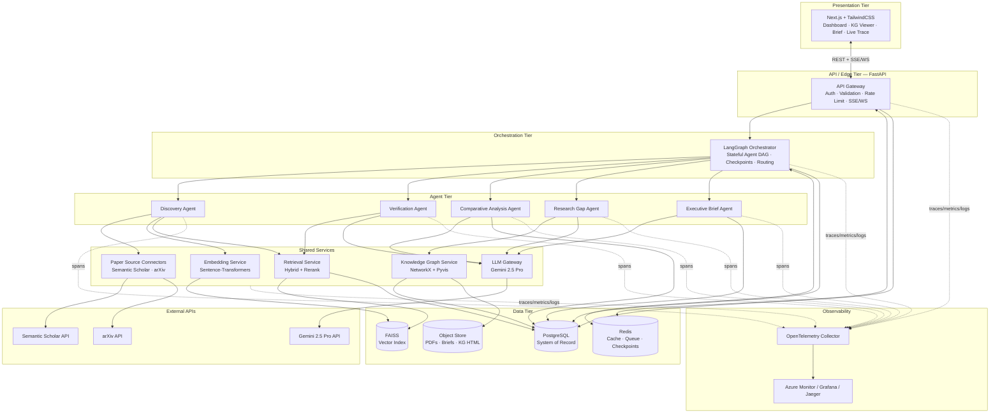

### 2.4 Data flow (end-to-end research query)

1. **User** submits a research question (e.g., *"What are the trade-offs of mixture-of-experts vs dense LLMs for inference cost?"*).
2. **Gateway** authenticates, validates, checks Redis cache for an identical recent query (cache hit → return). On miss, creates a `research_session` + `query` row, returns a `session_id`, and opens an SSE stream.
3. **Orchestrator** initializes shared state and starts the DAG.
4. **Discovery Agent** → connectors fetch candidate papers (Semantic Scholar + arXiv), dedupe by DOI/arXiv-id/title-hash, chunk + embed abstracts/sections, upsert to FAISS + Postgres, retrieve top-k relevant chunks.
5. **Verification Agent** → for each candidate claim, runs entailment (evidence ⊨ claim) using retrieved chunks; assigns `SUPPORTED / PARTIAL / UNSUPPORTED / REFUTED` + confidence. Unsupported claims are dropped.
6. **Comparative Agent** → builds an agreement/disagreement matrix across verified claims grouped by sub-topic.
7. **Gap Agent** → consumes comparison + KG to emit contradictions and under-explored areas.
8. **KG service** → materializes nodes/edges (papers, authors, topics, claims, contradictions) into Postgres + a Pyvis HTML artifact.
9. **Executive Brief Agent** → composes a cited brief strictly from verified claims; every sentence carries citation IDs.
10. **Orchestrator** persists all intermediate + final outputs, checkpoints completion, emits final SSE event.
11. **Frontend** renders the brief, the interactive KG, and the full agent trace (explainability).

---

## SECTION 3 — LangGraph Multi-Agent Design

### 3.0 Why 5 agents is the optimal number

We map agents to **distinct cognitive objectives**, not to micro-tasks. Each of the 8 mission capabilities maps cleanly onto these 5 roles:

| Mission capability | Owning agent |
|---|---|
| 1. Discover papers | Discovery |
| 2. Semantic retrieval | Discovery |
| 3. Verify claims w/ citations | Verification |
| 4. Compare findings | Comparative |
| 5. Detect contradictions + gaps | Gap |
| 6. Generate executive brief | Executive Brief |
| 7. Knowledge graph | KG service (deterministic, *not* an LLM agent) |
| 8. Claim-level grounding | Cross-cutting contract enforced by Verification |

**Why not fewer?** Merging Verification into Discovery would couple retrieval with entailment, destroying fault isolation and making grounding non-auditable. Merging Gap into Comparative blurs two different objectives (*describe differences* vs *reason about absence*).

**Why not more?** A separate "Summarizer," "Citation formatter," "Ranking," or "Router" agent would be **over-engineering** — those are deterministic functions or sub-steps, not autonomous reasoning roles. The KG is intentionally a *deterministic service*, not an LLM agent, because graph construction must be reproducible and cheap. Adding LLM agents for deterministic work increases cost, latency, and failure surface with no reasoning benefit.

> **Principle:** *One agent per distinct objective function. Everything deterministic is a service, not an agent.*

LangGraph topology (conceptual): a primarily linear DAG with conditional edges, retries per node, and a cyclic refinement loop between Verification ↔ Discovery (if too few claims survive verification, re-discover with widened query).

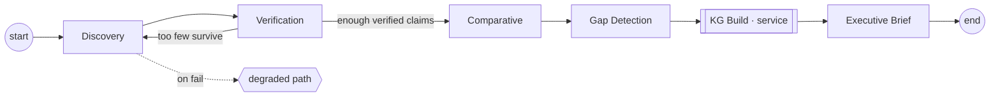

---

### 3.1 Discovery Agent

- **Purpose:** Find, deduplicate, embed, and retrieve the most relevant papers/chunks for the research question. The "librarian + retriever."
- **Inputs:** `query_text`, `session_id`, optional filters (year range, venue, min citations), `k` (retrieval depth), prior session findings (for follow-up queries).
- **Outputs:** Ranked list of papers + retrieved chunks with similarity scores, candidate claims extracted from top chunks.
- **Prompt strategy:** Two-stage. (a) *Query expansion* — LLM rewrites the question into 3–5 diverse search queries (synonyms, sub-questions, method/outcome variants) to improve recall. (b) *Candidate claim extraction* — low-temp structured extraction of atomic claims from top chunks. Temperature ≈ 0.2. Few-shot examples for claim atomicity.
- **Memory requirements:** Session-scoped working memory (already-seen paper IDs to avoid re-fetch), short-term cache of expanded queries (Redis, TTL). No long-term cross-user memory.
- **Failure handling:** Per-source timeout + retry with backoff; if one source (e.g., Semantic Scholar) fails, proceed with the other (graceful degradation). If both fail → fall back to FAISS-only over previously ingested corpus; if empty → emit `DISCOVERY_EMPTY` and short-circuit the graph to a partial result.
- **Communication:** Writes `papers`, `retrieval_results`, `candidate_claims` into shared state; signals Verification. Receives re-discovery requests from Verification (cyclic edge) with a widened query.
- **Why necessary:** Quality of everything downstream is bounded by retrieval quality. Multi-query expansion + dedup + hybrid retrieval is its own optimization problem.
- **Expected JSON schema:**

```json
{
  "agent": "discovery",
  "session_id": "uuid",
  "expanded_queries": ["string"],
  "papers": [
    {
      "paper_id": "uuid",
      "external_ids": {"doi": "string|null", "arxiv": "string|null", "ss_id": "string|null"},
      "title": "string",
      "authors": ["string"],
      "year": 2025,
      "venue": "string|null",
      "citation_count": 0,
      "source": "semantic_scholar|arxiv",
      "relevance_score": 0.0
    }
  ],
  "retrieval_results": [
    {"chunk_id": "uuid", "paper_id": "uuid", "text": "string", "similarity": 0.0, "section": "string"}
  ],
  "candidate_claims": [
    {"claim_id": "uuid", "text": "string", "source_chunk_id": "uuid", "paper_id": "uuid"}
  ],
  "status": "ok|degraded|empty"
}
```

---

### 3.2 Verification Agent

- **Purpose:** Enforce claim-level grounding. For each candidate claim, decide whether retrieved evidence *entails* it, and attach a verifiable citation + confidence. The "fact-checker."
- **Inputs:** `candidate_claims`, their `source_chunk_id`s + additional retrieved evidence chunks, full chunk text.
- **Outputs:** `verified_claims` with `support_label ∈ {SUPPORTED, PARTIALLY_SUPPORTED, UNSUPPORTED, REFUTED}`, `confidence`, `evidence_quote`, `citation`.
- **Prompt strategy:** Strict NLI-style entailment. Temperature = 0. The prompt forbids using outside knowledge: *"Judge ONLY whether the EVIDENCE supports the CLAIM. If evidence is insufficient, label UNSUPPORTED."* Require a verbatim `evidence_quote` span. Self-consistency: optionally 2 samples → take conservative label. Confidence = f(retrieval_similarity, entailment_strength).
- **Memory requirements:** Stateless per claim (pure function), enabling parallel map over claims. Caches (chunk, claim) → verdict in Redis to avoid recompute.
- **Failure handling:** Malformed LLM output → schema-repair retry (max 2), then default to `UNSUPPORTED` (fail-safe = drop, never fabricate). Timeout → mark claim `deferred`, exclude from brief but log. If >X% of claims unsupported → signal Discovery to widen search (cyclic edge).
- **Communication:** Reads `candidate_claims` from state, writes `verified_claims`. Can trigger re-discovery. Feeds Comparative + KG.
- **Why necessary:** This is the heart of "minimize hallucination." Without an independent verification pass, grounding is just a hope. Isolating it lets us run it at temp 0 and audit it.
- **Expected JSON schema:**

```json
{
  "agent": "verification",
  "session_id": "uuid",
  "verified_claims": [
    {
      "claim_id": "uuid",
      "text": "string",
      "paper_id": "uuid",
      "source_chunk_id": "uuid",
      "support_label": "SUPPORTED|PARTIALLY_SUPPORTED|UNSUPPORTED|REFUTED",
      "confidence": 0.0,
      "evidence_quote": "verbatim span from chunk",
      "citation": {"title": "string", "authors": ["string"], "year": 2025, "external_id": "string"}
    }
  ],
  "stats": {"total": 0, "supported": 0, "unsupported": 0, "refuted": 0},
  "status": "ok|needs_rediscovery"
}
```

---

### 3.3 Comparative Analysis Agent

- **Purpose:** Compare verified findings across papers — agreements, disagreements, conditions/assumptions that explain differences. The "analyst."
- **Inputs:** `verified_claims` (SUPPORTED/PARTIAL only), paper metadata, sub-topic clustering.
- **Outputs:** Sub-topic clusters, an agreement matrix (claim×claim or paper×paper), narrative comparison per cluster, identified *tensions* (precursor to contradictions).
- **Prompt strategy:** Group claims by sub-topic (embedding clustering done as a service, not by LLM), then per cluster ask the LLM to produce a structured comparison: *agree / disagree / conditional*, with the *reason* (different dataset, metric, assumption). Temperature ≈ 0.3. Require every comparison cell to reference claim IDs (grounding preserved).
- **Memory requirements:** Session-scoped; holds the cluster map. No long-term memory.
- **Failure handling:** If a cluster is too large for context, map-reduce (compare in pairs, then aggregate). On LLM failure for one cluster, skip that cluster and continue (partial result) with a logged warning.
- **Communication:** Reads `verified_claims`, writes `comparative_analysis`; feeds Gap Agent + KG (disagreement edges).
- **Why necessary:** Comparison is the bridge between isolated facts and insight. It also produces the structured "tensions" the Gap Agent needs to find contradictions reliably (rather than re-deriving them).
- **Expected JSON schema:**

```json
{
  "agent": "comparative",
  "session_id": "uuid",
  "clusters": [
    {
      "cluster_id": "uuid",
      "subtopic": "string",
      "claim_ids": ["uuid"],
      "comparisons": [
        {
          "claim_a": "uuid",
          "claim_b": "uuid",
          "relation": "AGREE|DISAGREE|CONDITIONAL",
          "reason": "string",
          "conditions": ["dataset/metric/assumption ..."]
        }
      ]
    }
  ],
  "status": "ok|partial"
}
```

---

### 3.4 Research Gap Detection Agent

- **Purpose:** Identify (a) **contradictions** (claims that refute each other) and (b) **research gaps** (under-explored, untested, or methodologically weak areas). The "critic/strategist."
- **Inputs:** `comparative_analysis`, `verified_claims`, KG topology (topic coverage, edge density), paper metadata (years, methods).
- **Outputs:** Ranked contradictions (with both sides + evidence) and ranked research gaps (with rationale + suggested direction).
- **Prompt strategy:** Two sub-prompts. (a) *Contradiction confirmation* — take `DISAGREE` tensions + any `REFUTED` claims, confirm true logical/empirical contradiction vs mere conditional difference (temp 0). (b) *Gap reasoning* — given topic coverage stats (counts per subtopic, recency, method diversity from KG) + the comparison, reason about absence: "Topic X is heavily studied on dataset A but never on B"; "Method M lacks reproduction." Temp ≈ 0.4. Explicitly require gaps to be grounded in observed coverage stats, not invented.
- **Memory requirements:** Session-scoped + reads KG metrics. No long-term memory.
- **Failure handling:** If KG metrics unavailable, degrade to comparison-only gap reasoning. Each gap must cite supporting evidence/stat; ungrounded gaps are filtered out.
- **Communication:** Reads comparison + KG, writes `research_gaps` + `contradictions`; feeds Executive Brief + KG (contradiction edges).
- **Why necessary:** This is the platform's **differentiator** — the capability no generic RAG tool has. Gap detection is what makes this "research intelligence," not search.
- **Expected JSON schema:**

```json
{
  "agent": "gap_detection",
  "session_id": "uuid",
  "contradictions": [
    {
      "contradiction_id": "uuid",
      "claim_a": "uuid",
      "claim_b": "uuid",
      "explanation": "string",
      "severity": "HIGH|MEDIUM|LOW",
      "evidence": [{"paper_id": "uuid", "quote": "string"}]
    }
  ],
  "research_gaps": [
    {
      "gap_id": "uuid",
      "description": "string",
      "rationale": "string (grounded in coverage stats)",
      "supporting_metric": {"subtopic": "string", "paper_count": 0, "recency": "string"},
      "suggested_direction": "string",
      "impact_rank": 1
    }
  ],
  "status": "ok|degraded"
}
```

---

### 3.5 Executive Brief Agent

- **Purpose:** Compose a decision-grade, fully cited research brief from validated outputs. The "editor."
- **Inputs:** `verified_claims`, `comparative_analysis`, `contradictions`, `research_gaps`, query, session metadata.
- **Outputs:** Structured brief: executive summary, key findings (cited), points of consensus, points of contradiction, research gaps & opportunities, methodology/coverage note, full reference list.
- **Prompt strategy:** Constrained generation — *"Use ONLY the provided verified claims; every sentence in Key Findings MUST include citation IDs; do not introduce new facts."* Temperature ≈ 0.4 for readability while grounding stays locked via input restriction. Post-generation **citation validator** (deterministic) checks every citation ID exists in `verified_claims`; on mismatch → regenerate the offending section.
- **Memory requirements:** Session-scoped; pulls the full validated artifact set. Brief stored to Postgres + object store (Markdown/PDF/HTML).
- **Failure handling:** Citation-validation failure → targeted section regeneration (max 2). If still failing → emit brief with flagged unverifiable sentences removed (never ship ungrounded text). Length overflow → hierarchical summarization.
- **Communication:** Terminal node; reads everything, writes `executive_reports`. Emits final SSE event.
- **Why necessary:** The brief is the deliverable the user actually consumes. Separating it ensures the synthesis style is optimized independently while grounding remains enforced.
- **Expected JSON schema:**

```json
{
  "agent": "executive_brief",
  "session_id": "uuid",
  "report": {
    "title": "string",
    "executive_summary": "string",
    "key_findings": [{"text": "string", "citation_ids": ["uuid"]}],
    "consensus": [{"text": "string", "citation_ids": ["uuid"]}],
    "contradictions": [{"text": "string", "contradiction_id": "uuid"}],
    "gaps": [{"text": "string", "gap_id": "uuid"}],
    "coverage_note": "string",
    "references": [{"paper_id": "uuid", "citation": "string"}]
  },
  "citation_integrity": {"validated": true, "orphan_citations": 0},
  "status": "ok|partial"
}
```

---

## SECTION 4 — State Management

### 4.1 Shared state (the LangGraph `State` object)

A single typed, append-mostly state dictionary flows through the graph. Reducers control how each node merges its output (LangGraph annotated reducers).

```text
SynaptiQState:
  # identity / control
  session_id: str
  query_id: str
  query_text: str
  filters: dict
  control: { current_node, retries: dict[node,int], started_at, status }

  # accumulating artifacts (reducer = append / merge)
  expanded_queries: list[str]
  papers: list[Paper]
  retrieval_results: list[Chunk]
  candidate_claims: list[Claim]
  verified_claims: list[VerifiedClaim]
  comparative_analysis: ComparativeResult
  contradictions: list[Contradiction]
  research_gaps: list[Gap]
  kg_ref: { node_count, edge_count, html_uri }
  executive_report: Report

  # diagnostics
  errors: list[{ node, type, message, ts }]   # reducer = append
  metrics: { tokens, latency_ms_per_node, cost }
  trace_id: str
```

**Reducer policy:** lists use append reducers (no clobbering across retries); scalar control fields use last-write-wins; `errors` always appends. This makes retries and partial failures non-destructive.

### 4.2 Conversation memory (session-level)

- A `research_session` groups multiple queries (a research thread).
- Conversation memory = ordered prior `(query, key_findings_summary)` tuples, stored in Postgres, summarized into a compact "session context" injected into Discovery's query expansion so follow-up questions build on prior findings.
- Cap injected history (e.g., last N findings + a rolling summary) to bound tokens.

### 4.3 Agent memory

| Memory type | Scope | Store | Purpose |
|---|---|---|---|
| Working memory | Single graph run | LangGraph state (in Redis checkpoint) | Pass artifacts between nodes |
| Short-term cache | Minutes–hours | Redis (TTL) | Cache expanded queries, embeddings, (claim,chunk) verdicts |
| Episodic/session | Session lifetime | Postgres | Prior queries + findings for continuity |
| Long-term corpus | Persistent | Postgres + FAISS | Ingested papers/chunks reused across sessions/users |

Agents are otherwise **stateless functions** over the shared state — critical for parallelism, testing, and replay.

### 4.4 Intermediate outputs

Every node's output is (a) merged into state and (b) persisted to its Postgres table *before* transitioning. This dual-write gives durability independent of the checkpointer and lets the UI render partial progress live.

### 4.5 Persistence strategy

- **System of record:** PostgreSQL — every entity (papers, claims, analyses, gaps, reports, logs).
- **Vector index:** FAISS — embeddings, persisted to disk and to object store (snapshot) with an `id ↔ chunk_id` sidecar mapping in Postgres so the index is rebuildable.
- **Checkpoints:** LangGraph checkpointer backed by Redis (hot) with periodic flush to Postgres (durable) for crash recovery.
- **Artifacts:** Briefs (MD/PDF) and KG HTML in Azure Blob Storage; URIs in Postgres.

### 4.6 Checkpointing

- Checkpoint **after every node** (LangGraph thread = `session_id:query_id`).
- Each checkpoint stores the full serialized state + which node completed.
- Enables: resume after crash, time-travel debugging, and human-in-the-loop pause/resume.

### 4.7 Error recovery

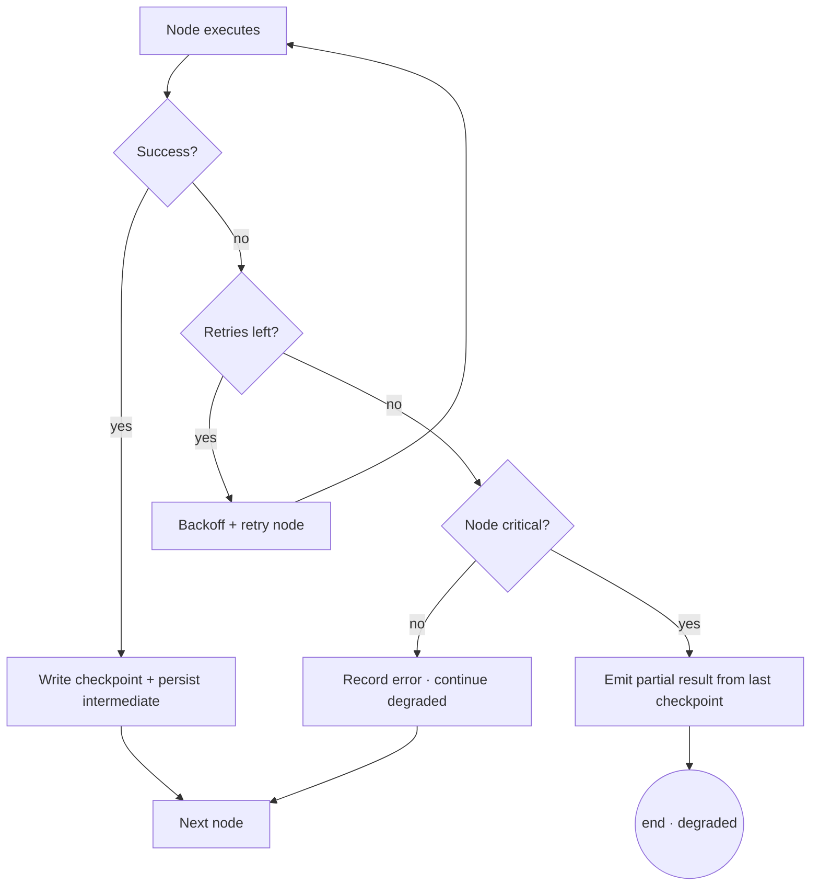

- **Idempotency:** nodes key writes by deterministic IDs so retried writes upsert, not duplicate.
- **Compensation:** if KG build fails, downstream Brief proceeds without graph metrics (degraded), flagged in `coverage_note`.
- **Crash recovery:** on restart, orchestrator loads the latest checkpoint for the thread and resumes from the next node.

---

## SECTION 5 — Database Design

### 5.1 Design philosophy

- **3NF core** for entities (users, sessions, queries, papers, authors) to avoid update anomalies.
- **Selective denormalization** for read-heavy artifacts (executive_reports stores rendered JSON/MD) for fast retrieval.
- **JSONB** for semi-structured, evolving agent payloads (LLM outputs) while keeping queryable columns extracted.
- **UUID** primary keys everywhere (distributed-friendly, no enumeration leakage).
- **Soft deletes** (`deleted_at`) on user-facing entities; hard deletes for logs via retention jobs.
- **`created_at/updated_at`** on every table; indexes on FKs and common filter columns.

### 5.2 Table specifications

> Notation: PK = primary key, FK = foreign key, `idx` = index.

#### `users`
| Column | Type | Notes |
|---|---|---|
| user_id | UUID | PK |
| email | CITEXT | UNIQUE, NOT NULL |
| display_name | TEXT | |
| role | TEXT | enum: admin/researcher/viewer |
| password_hash | TEXT | (or external IdP subject) |
| org_id | UUID | FK → orgs (multi-tenant ready) |
| created_at, updated_at, deleted_at | TIMESTAMPTZ | |
- idx: `(email)`, `(org_id)`

#### `research_sessions`
| Column | Type | Notes |
|---|---|---|
| session_id | UUID | PK |
| user_id | UUID | FK → users |
| title | TEXT | auto from first query |
| status | TEXT | active/completed/archived |
| context_summary | TEXT | rolling memory summary |
| created_at, updated_at | TIMESTAMPTZ | |
- idx: `(user_id, created_at)`

#### `queries`
| Column | Type | Notes |
|---|---|---|
| query_id | UUID | PK |
| session_id | UUID | FK → research_sessions |
| query_text | TEXT | NOT NULL |
| filters | JSONB | year/venue/etc |
| status | TEXT | running/completed/failed/degraded |
| expanded_queries | JSONB | |
| latency_ms | INT | |
| token_cost | INT | |
| created_at, completed_at | TIMESTAMPTZ | |
- idx: `(session_id)`, `(status)`, `(query_text)` GIN trigram for dedup/cache

#### `papers`
| Column | Type | Notes |
|---|---|---|
| paper_id | UUID | PK |
| doi | TEXT | UNIQUE NULLABLE |
| arxiv_id | TEXT | UNIQUE NULLABLE |
| ss_id | TEXT | UNIQUE NULLABLE (Semantic Scholar) |
| title | TEXT | NOT NULL |
| abstract | TEXT | |
| year | INT | |
| venue | TEXT | |
| citation_count | INT | |
| source | TEXT | semantic_scholar/arxiv |
| pdf_uri | TEXT | object store |
| title_hash | TEXT | for dedup |
| created_at | TIMESTAMPTZ | |
- idx: `(doi)`, `(arxiv_id)`, `(title_hash)`, `(year)`

#### `authors` + `paper_authors` (join, M:N normalization)
`authors(author_id PK, name, ss_author_id, h_index)`;
`paper_authors(paper_id FK, author_id FK, author_order, PK(paper_id,author_id))`.

#### `retrieval_results`
| Column | Type | Notes |
|---|---|---|
| retrieval_id | UUID | PK |
| query_id | UUID | FK → queries |
| paper_id | UUID | FK → papers |
| chunk_id | UUID | FK → chunks |
| similarity | REAL | dense score |
| lexical_score | REAL | BM25 |
| rerank_score | REAL | final |
| rank | INT | |
- idx: `(query_id, rank)`

> Supporting table `chunks(chunk_id PK, paper_id FK, section, text, token_count, faiss_id BIGINT UNIQUE)` links FAISS vectors to source text.

#### `verified_claims`
| Column | Type | Notes |
|---|---|---|
| claim_id | UUID | PK |
| query_id | UUID | FK → queries |
| paper_id | UUID | FK → papers |
| source_chunk_id | UUID | FK → chunks |
| text | TEXT | claim |
| support_label | TEXT | SUPPORTED/PARTIAL/UNSUPPORTED/REFUTED |
| confidence | REAL | |
| evidence_quote | TEXT | verbatim |
| created_at | TIMESTAMPTZ | |
- idx: `(query_id)`, `(paper_id)`, `(support_label)`

#### `comparative_analysis`
| Column | Type | Notes |
|---|---|---|
| analysis_id | UUID | PK |
| query_id | UUID | FK → queries |
| cluster_subtopic | TEXT | |
| claim_a | UUID | FK → verified_claims |
| claim_b | UUID | FK → verified_claims |
| relation | TEXT | AGREE/DISAGREE/CONDITIONAL |
| reason | TEXT | |
| conditions | JSONB | |
- idx: `(query_id)`, `(relation)`

#### `research_gaps`
| Column | Type | Notes |
|---|---|---|
| gap_id | UUID | PK |
| query_id | UUID | FK → queries |
| description | TEXT | |
| rationale | TEXT | |
| supporting_metric | JSONB | |
| suggested_direction | TEXT | |
| impact_rank | INT | |
- idx: `(query_id, impact_rank)`

> Contradictions stored as `contradictions(contradiction_id PK, query_id FK, claim_a FK, claim_b FK, explanation, severity, evidence JSONB)`.

#### `executive_reports`
| Column | Type | Notes |
|---|---|---|
| report_id | UUID | PK |
| query_id | UUID | FK → queries (UNIQUE) |
| title | TEXT | |
| report_json | JSONB | structured brief |
| markdown_uri | TEXT | object store |
| pdf_uri | TEXT | object store |
| citation_integrity | JSONB | validation result |
| created_at | TIMESTAMPTZ | |
- idx: `(query_id)`

#### `knowledge_graph_nodes`
| Column | Type | Notes |
|---|---|---|
| node_id | UUID | PK |
| query_id | UUID | FK → queries |
| node_type | TEXT | paper/author/topic/claim/contradiction/cluster |
| ref_id | UUID | points to underlying entity |
| label | TEXT | |
| properties | JSONB | size/centrality/year/etc |
- idx: `(query_id, node_type)`

#### `knowledge_graph_edges`
| Column | Type | Notes |
|---|---|---|
| edge_id | UUID | PK |
| query_id | UUID | FK → queries |
| source_node | UUID | FK → knowledge_graph_nodes |
| target_node | UUID | FK → knowledge_graph_nodes |
| edge_type | TEXT | cites/authored_by/about_topic/supports/contradicts/similar_to |
| weight | REAL | |
| properties | JSONB | |
- idx: `(query_id, edge_type)`, `(source_node)`, `(target_node)`

#### `agent_logs`
| Column | Type | Notes |
|---|---|---|
| log_id | UUID | PK |
| session_id | UUID | FK |
| query_id | UUID | FK |
| agent | TEXT | which agent/node |
| trace_id | TEXT | OTel correlation |
| span_id | TEXT | |
| status | TEXT | ok/retry/failed/degraded |
| input_summary | JSONB | |
| output_summary | JSONB | |
| latency_ms | INT | |
| token_in, token_out | INT | |
| error | JSONB | |
| created_at | TIMESTAMPTZ | |
- idx: `(query_id)`, `(agent)`, `(trace_id)`, `(created_at)` (partitioned by month)

#### `system_metrics`
| Column | Type | Notes |
|---|---|---|
| metric_id | UUID | PK |
| metric_name | TEXT | latency/tokens/cache_hit/error_rate |
| metric_value | REAL | |
| labels | JSONB | agent, endpoint, status |
| recorded_at | TIMESTAMPTZ | |
- idx: `(metric_name, recorded_at)` (time-series, partitioned)

### 5.3 ER diagram (Mermaid)

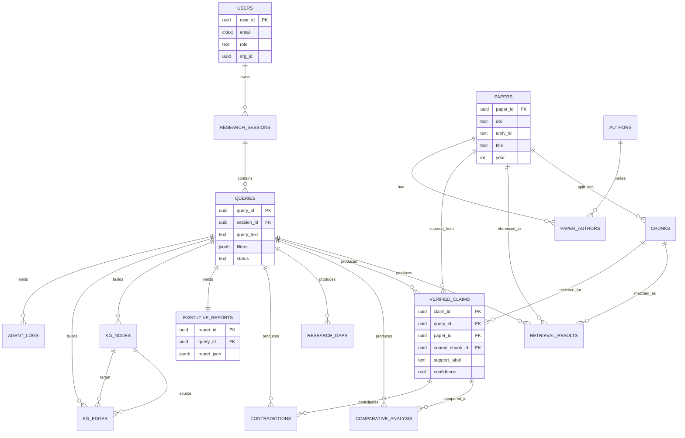

### 5.4 Normalization strategy summary

- Entities (`users`, `papers`, `authors`, `queries`) → **3NF**.
- M:N (`paper_authors`) → join table (avoids repeating groups).
- Agent outputs (`*_analysis`, `gaps`, `reports`) → normalized FKs + JSONB for the flexible payload (pragmatic 3NF + document hybrid).
- Logs/metrics → **append-only, partitioned by time**, indexed for query, denormalized on purpose (write-optimized).

---

## SECTION 6 — Vector Database Design

### 6.1 Why FAISS

- **In-process, zero external dependency** → perfect for a buildathon demo (no managed vector DB cost/setup) yet production-credible.
- **Proven scale & speed** — IVF/HNSW/PQ indexes handle millions of vectors with millisecond ANN search.
- **Flexible index types** — start with `IndexFlatIP` (exact) for the demo corpus, switch to `IndexHNSWFlat` or `IVF+PQ` for scale without API changes.
- **Full control** over persistence, sharding, and the `faiss_id ↔ chunk_id` mapping (kept in Postgres → fully rebuildable).
- Cosine similarity via normalized embeddings + inner product.

> Trade-off acknowledged: FAISS lacks built-in metadata filtering and horizontal scaling. We compensate with a **Postgres metadata sidecar** (filter candidate IDs in SQL, then ANN search) and a sharding plan (per-tenant or per-corpus indexes) for scale.

### 6.2 Embedding pipeline

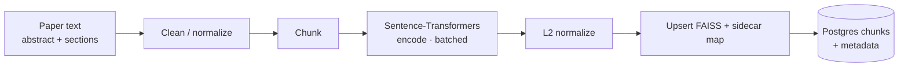

- Model: a strong general retrieval embedding from Sentence-Transformers (e.g., `all-mpnet-base-v2` quality tier, or `bge`/`gte` family). Single model for index + query (symmetric) — never mix models.
- Batched GPU/CPU encoding; embeddings cached in Redis keyed by `hash(text, model)` to avoid recompute.

### 6.3 Chunking strategy

- **Structure-aware chunking**: split on section boundaries (Abstract, Intro, Method, Results, Conclusion) first, then sliding window within long sections.
- Target ~256–400 tokens per chunk with ~15% overlap (preserves cross-sentence context for entailment).
- Each chunk retains `section` label (improves retrieval + lets Verification weight Results/Conclusion higher).
- Abstracts always chunked separately (high-signal for discovery).

### 6.4 Metadata (sidecar in Postgres `chunks`)

`{ chunk_id, paper_id, section, token_count, faiss_id, year, venue, source }`. Metadata enables **pre-filtering** (e.g., year ≥ 2022) before/after ANN.

### 6.5 Citation storage

The citation chain is explicit and queryable: `verified_claims.source_chunk_id → chunks.paper_id → papers(doi/arxiv/title)`. Each retrieved chunk carries enough to reconstruct a full citation, so every claim and every brief sentence is traceable to an exact span in an exact paper.

### 6.6 Retrieval flow

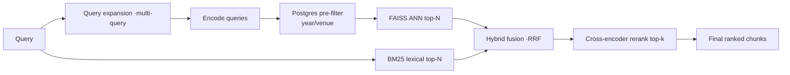

### 6.7 Similarity search & ranking

- **Dense**: normalized inner product (cosine) ANN over FAISS.
- **Lexical**: BM25 (Postgres full-text or rank-bm25) to catch exact-term/rare-term matches embeddings miss.
- **Fusion**: Reciprocal Rank Fusion (RRF) merges dense + lexical rankings (robust, parameter-light).
- **Rerank**: optional cross-encoder reranker on the fused top-N for precision at small k (high judge-impact, moderate cost).

### 6.8 Hybrid retrieval rationale

Pure dense retrieval misses exact identifiers (method names, dataset names, equations); pure lexical misses paraphrase. Hybrid + RRF + rerank maximizes both **recall** (don't miss the contradicting paper) and **precision** (don't poison verification with noise) — directly improving grounding quality downstream.

---

## SECTION 7 — API Design

### 7.1 Conventions

- Base path `/api/v1`. JSON everywhere. ISO-8601 timestamps. UUID IDs.
- Auth: OAuth2 Bearer (JWT) via `Authorization` header; Azure AD / Entra ID compatible.
- Standard error envelope, idempotency keys on mutating long-running calls, cursor pagination on lists.
- Long-running analysis is **async**: `POST /analyze` returns `202` + `session/query id`, progress via **SSE** (`/stream`).

### 7.2 Endpoints

| Method | Path | Purpose |
|---|---|---|
| POST | `/auth/login` | Obtain JWT (or redirect to Entra ID) |
| POST | `/auth/refresh` | Refresh token |
| GET | `/auth/me` | Current user |
| POST | `/sessions` | Create research session |
| GET | `/sessions` | List sessions (paginated) |
| GET | `/sessions/{id}` | Session detail + history |
| DELETE | `/sessions/{id}` | Archive/soft-delete |
| POST | `/papers/upload` | Upload a PDF for private ingestion |
| GET | `/papers/{id}` | Paper metadata |
| POST | `/search` | Discovery-only: retrieve papers/chunks (sync, cacheable) |
| POST | `/analyze` | Full multi-agent run (async → 202) |
| GET | `/analyze/{query_id}/stream` | SSE stream of agent progress |
| POST | `/verify` | Verify a specific set of claims (sync) |
| GET | `/reports/{query_id}` | Fetch executive brief (JSON/MD/PDF) |
| GET | `/graph/{query_id}` | KG data (JSON) |
| GET | `/graph/{query_id}/html` | Pyvis interactive HTML artifact |
| GET | `/queries/{id}` | Query status + intermediate outputs |
| GET | `/health` `/ready` | Liveness/readiness |
| GET | `/metrics` | Prometheus scrape (internal) |

### 7.3 OpenAPI-style specification (selected)

```yaml
openapi: 3.0.3
info: { title: SynaptiQ ResearchOS API, version: 1.0.0 }
paths:
  /api/v1/analyze:
    post:
      summary: Run full multi-agent research analysis
      security: [ { bearerAuth: [] } ]
      parameters:
        - in: header
          name: Idempotency-Key
          schema: { type: string }
      requestBody:
        required: true
        content:
          application/json:
            schema:
              type: object
              required: [session_id, query_text]
              properties:
                session_id: { type: string, format: uuid }
                query_text: { type: string, maxLength: 2000 }
                filters:
                  type: object
                  properties:
                    year_min: { type: integer }
                    year_max: { type: integer }
                    min_citations: { type: integer }
                    sources:
                      type: array
                      items: { type: string, enum: [semantic_scholar, arxiv] }
                k: { type: integer, default: 20, maximum: 100 }
      responses:
        "202":
          description: Accepted; analysis started
          content:
            application/json:
              schema:
                type: object
                properties:
                  query_id: { type: string, format: uuid }
                  status: { type: string, example: running }
                  stream_url: { type: string }
        "400": { $ref: "#/components/responses/BadRequest" }
        "401": { $ref: "#/components/responses/Unauthorized" }
        "429": { $ref: "#/components/responses/RateLimited" }
  /api/v1/reports/{query_id}:
    get:
      summary: Fetch executive brief
      security: [ { bearerAuth: [] } ]
      parameters:
        - in: path
          name: query_id
          required: true
          schema: { type: string, format: uuid }
        - in: query
          name: format
          schema: { type: string, enum: [json, markdown, pdf], default: json }
      responses:
        "200":
          description: Brief
          content:
            application/json:
              schema: { $ref: "#/components/schemas/ExecutiveReport" }
        "404": { $ref: "#/components/responses/NotFound" }

components:
  securitySchemes:
    bearerAuth: { type: http, scheme: bearer, bearerFormat: JWT }
  schemas:
    ExecutiveReport:
      type: object
      properties:
        query_id: { type: string, format: uuid }
        title: { type: string }
        executive_summary: { type: string }
        key_findings:
          type: array
          items:
            type: object
            properties:
              text: { type: string }
              citation_ids: { type: array, items: { type: string } }
        contradictions: { type: array, items: { type: object } }
        gaps: { type: array, items: { type: object } }
        references: { type: array, items: { type: object } }
        citation_integrity:
          type: object
          properties:
            validated: { type: boolean }
            orphan_citations: { type: integer }
    Error:
      type: object
      properties:
        error:
          type: object
          properties:
            code: { type: string }
            message: { type: string }
            trace_id: { type: string }
            details: { type: object }
  responses:
    BadRequest:   { description: Invalid request, content: { application/json: { schema: { $ref: "#/components/schemas/Error" } } } }
    Unauthorized: { description: Missing/invalid token, content: { application/json: { schema: { $ref: "#/components/schemas/Error" } } } }
    NotFound:     { description: Not found, content: { application/json: { schema: { $ref: "#/components/schemas/Error" } } } }
    RateLimited:  { description: Too many requests, content: { application/json: { schema: { $ref: "#/components/schemas/Error" } } } }
```

### 7.4 Error schema (standard envelope)

```json
{ "error": { "code": "RETRIEVAL_EMPTY", "message": "No papers found for query", "trace_id": "otel-trace-id", "details": { "sources_tried": ["arxiv","semantic_scholar"] } } }
```

Stable machine-readable `code` enum (e.g., `VALIDATION_ERROR`, `UNAUTHORIZED`, `RATE_LIMITED`, `DISCOVERY_EMPTY`, `VERIFICATION_TIMEOUT`, `LLM_UNAVAILABLE`, `INTERNAL`). `trace_id` ties every error to OTel.

### 7.5 Rate limiting

- Redis token-bucket per `user_id` + per `IP`, per-endpoint tiers (e.g., `/analyze` is expensive → lower limit).
- Headers: `X-RateLimit-Limit`, `X-RateLimit-Remaining`, `Retry-After`.
- Separate **global LLM budget guard** (token/cost ceiling) to protect Gemini quota during the demo.

### 7.6 Caching strategy

| Layer | What | Key | TTL |
|---|---|---|---|
| Response cache | `/search` results, completed `/reports` | hash(query+filters+user-scope) | minutes–hours |
| Embedding cache | text→vector | hash(text, model) | days |
| Retrieval cache | query→chunk IDs | hash(expanded_query) | hours |
| Verdict cache | (claim,chunk)→label | hash | hours |
| Connector cache | Semantic Scholar/arXiv responses | hash(api_query) | hours (respect source TTL) |

Cache-aside pattern via Redis; invalidate report cache when corpus for that query changes.

### 7.7 Request lifecycle (`/analyze`)

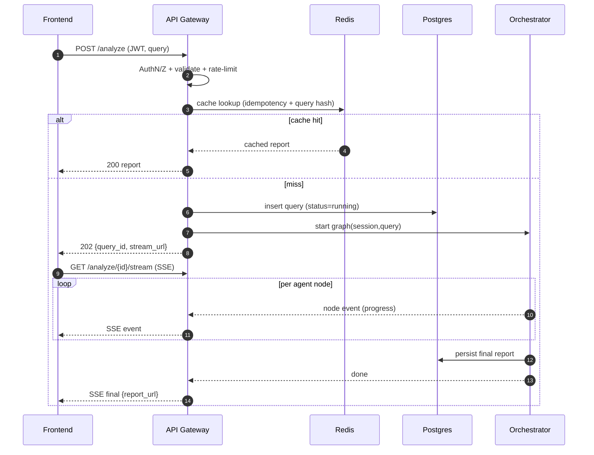

---

## SECTION 8 — Knowledge Graph Architecture

### 8.1 Node types

| Node type | Represents | Key properties |
|---|---|---|
| Paper | A paper | title, year, citation_count, relevance |
| Author | A researcher | name, h_index |
| Topic / Subtopic | A research theme (from clustering) | label, paper_count |
| Claim | A verified claim | support_label, confidence |
| Contradiction | A confirmed conflict | severity |
| Cluster | A group of similar papers/claims | size |

### 8.2 Edge types

| Edge | From → To | Meaning |
|---|---|---|
| `authored_by` | Paper → Author | authorship |
| `cites` | Paper → Paper | citation (from Semantic Scholar graph) |
| `about_topic` | Paper → Topic | topical membership |
| `makes_claim` | Paper → Claim | provenance |
| `supports` | Claim → Claim | corroboration (from Comparative AGREE) |
| `contradicts` | Claim → Claim / Paper → Paper | conflict (from Gap Agent) |
| `similar_to` | Paper → Paper | embedding similarity |
| `in_cluster` | Paper/Claim → Cluster | grouping |

### 8.3 Relationships, contradictions, topics, authors, clusters, papers

- **Papers** are central hubs; **authors** connect papers (co-authorship sub-graph), **topics** connect thematically, **claims** hang off papers and connect to each other via `supports`/`contradicts`.
- **Contradictions** are rendered as bold red edges between claims/papers — the single most visually compelling element for judges.
- **Clusters** (from embedding clustering) give the graph readable structure / communities; node size ∝ centrality (degree or PageRank), color ∝ cluster.

### 8.4 How NetworkX and Pyvis work together

- **NetworkX** = the *computational graph engine*: build the typed multigraph, run analytics (degree/PageRank centrality, community detection, shortest paths "how is paper A connected to paper C?", contradiction subgraph extraction). It is the source of truth for graph structure and metrics (those metrics feed the Gap Agent).
- **Pyvis** = the *visualization renderer*: consumes the NetworkX graph and emits a standalone interactive HTML (vis.js) with physics layout, zoom, hover tooltips, click-to-expand. We store this HTML in object store and embed it in the Next.js KG viewer via iframe/component.

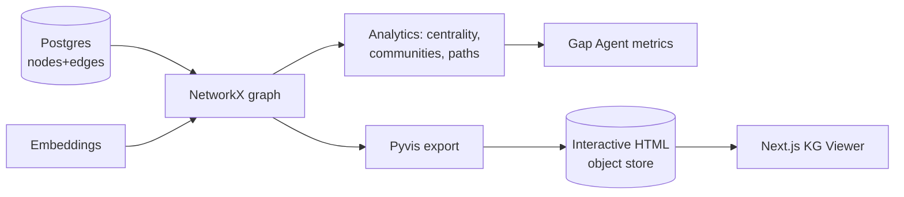

### 8.5 Graph examples

**Contradiction subgraph (illustrative):**

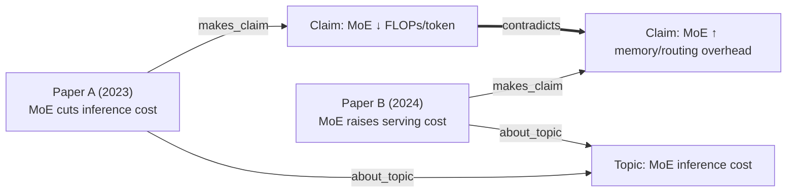

**Topic-author overview (illustrative):**

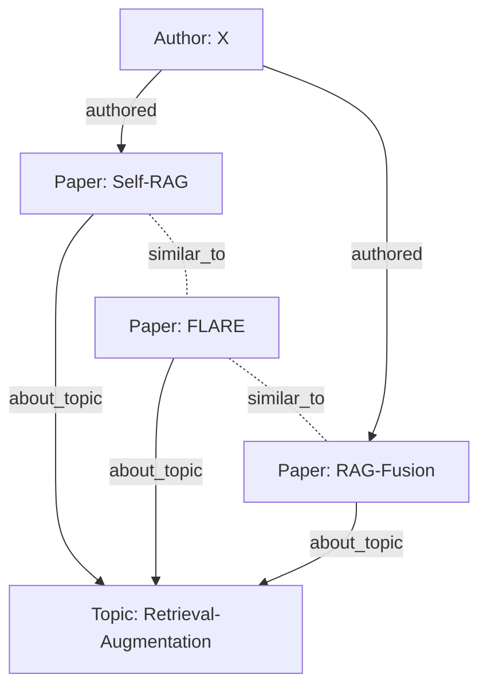

---

## SECTION 9 — Observability and Monitoring

### 9.1 OpenTelemetry tracing

- **One trace per `/analyze` request**, `trace_id` propagated from Gateway → Orchestrator → each agent → LLM gateway → DB.
- Each agent node = a **span**; sub-operations (retrieval, LLM call, DB write) = child spans.
- Span attributes: `agent`, `query_id`, `tokens_in/out`, `model`, `cache_hit`, `support_stats`, `retry_count`.
- This *is* the explainability backbone — the UI's "agent trace" view is rendered from these spans.

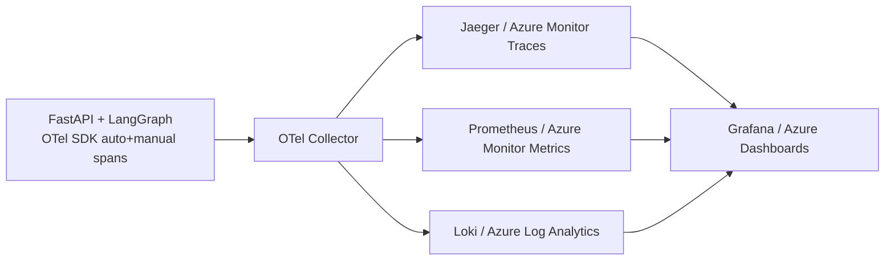

### 9.2 Logging

- **Structured JSON logs**, every line carries `trace_id`, `span_id`, `session_id`, `query_id`, `agent`.
- Levels: DEBUG (dev), INFO (lifecycle), WARN (degraded paths), ERROR (failures w/ stack + context).
- Dual sink: stdout (container) → Azure Log Analytics; durable agent-level summaries → `agent_logs` table for product features (trace replay).

### 9.3 Metrics (RED + LLM-specific)

| Metric | Type | Why |
|---|---|---|
| request_count / error_count / latency (p50/p95/p99) | RED | API health |
| agent_latency_ms{agent} | histogram | per-agent perf |
| llm_tokens{direction,model} | counter | cost control |
| llm_cost_usd | counter | budget |
| cache_hit_ratio{layer} | gauge | efficiency |
| verification_unsupported_ratio | gauge | grounding quality / hallucination proxy |
| retrieval_recall_proxy | gauge | retrieval health |
| graph_run_status{status} | counter | success/degraded/fail |
| external_api_errors{source} | counter | connector health |

### 9.4 Agent execution tracking

The `agent_logs` table + spans give per-node: status, latency, tokens, retries, in/out summaries. Powers the live trace UI and post-hoc debugging ("which agent slowed the run?").

### 9.5 Latency & failure monitoring

- Dashboards: end-to-end and per-agent latency; alert on p95 breach.
- Failure budget / error rate alerts; alert on `verification_unsupported_ratio` spike (signals retrieval degradation or model drift).
- LLM availability + circuit-breaker state alerts.

### 9.6 Distributed tracing & audit logs

- Distributed context propagation across all services (W3C trace context).
- **Audit log** (immutable, append-only): who ran what query, what sources were used, what the brief concluded, and the full citation chain — essential for enterprise/Capgemini compliance and reproducibility.

---

## SECTION 10 — Azure Deployment Architecture

### 10.1 Container strategy (Docker)

| Image | Contents |
|---|---|
| `synaptiq-frontend` | Next.js (standalone build) |
| `synaptiq-api` | FastAPI gateway + orchestrator (LangGraph) + agent runtime |
| `synaptiq-worker` | (optional) async analysis workers consuming Redis queue |
| `synaptiq-otel` | OpenTelemetry collector (sidecar/shared) |

Multi-stage builds, non-root user, pinned deps, healthchecks. FAISS index packaged on a mounted volume / Azure Files for persistence and warm start.

### 10.2 Azure services mapping

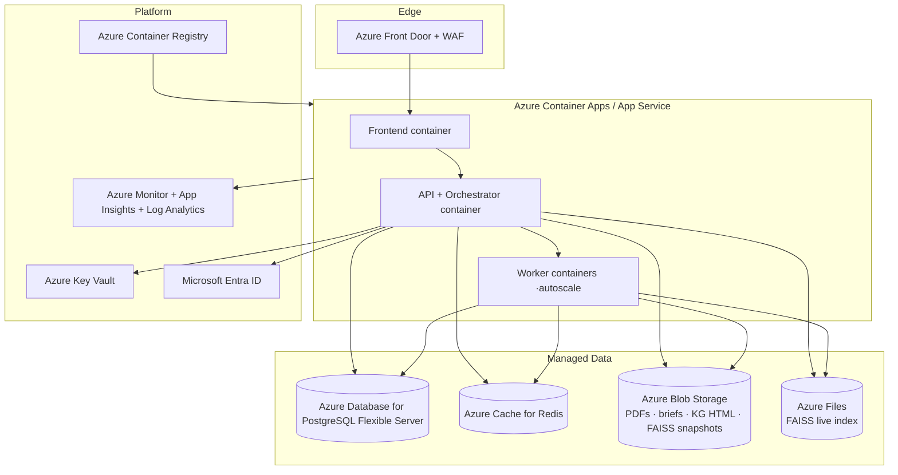

- **Compute:** Azure Container Apps (preferred: built-in autoscale, KEDA, revisions, scale-to-zero for workers) or App Service for Containers.
- **DB:** Azure Database for PostgreSQL Flexible Server (HA zone-redundant, automated backups, PITR).
- **Cache:** Azure Cache for Redis (Standard/Premium; persistence for checkpoints).
- **Storage:** Blob (artifacts + FAISS snapshots), Azure Files (live FAISS index shared volume).
- **Registry:** Azure Container Registry.
- **Identity/Auth:** Microsoft Entra ID (OIDC) for users; Managed Identity for service-to-service.

### 10.3 Scaling strategy

- **Frontend/API:** horizontal autoscale on CPU + RPS.
- **Workers:** KEDA scale on Redis queue length (scale-to-zero between demos to save cost).
- **Gemini:** concurrency-limited via LLM gateway + queue (respect rate limits); request coalescing via caches.
- **FAISS:** read-mostly; scale by replicating index to multiple API replicas (shared Azure Files) or sharding per tenant/corpus for large scale.
- **Postgres:** read replicas for analytics/dashboards; connection pooling (PgBouncer).

### 10.4 Security

- TLS everywhere; WAF at Front Door (OWASP rules).
- JWT/OIDC auth; RBAC by role; per-org tenant isolation.
- Network: private endpoints for Postgres/Redis/Blob; API behind VNet; no public DB.
- Input validation + output sanitation (KG HTML rendered in sandboxed iframe).
- Least-privilege Managed Identities; no secrets in code/images.

### 10.5 Secrets management

- **Azure Key Vault** holds Gemini API key, DB creds, JWT signing keys, connector keys.
- Containers fetch secrets via **Managed Identity** at runtime (no env-baked secrets). Rotation supported.

### 10.6 CI/CD

```mermaid
flowchart LR
    DEV[Push / PR] --> GH[GitHub Actions]
    GH --> LINT[Lint + Type + Unit tests]
    LINT --> SEC[Dependency + secret scan]
    SEC --> BUILD[Build images]
    BUILD --> PUSH[Push to ACR]
    PUSH --> STG[Deploy to Staging ·Container Apps revision]
    STG --> E2E[Smoke + E2E + eval suite]
    E2E --> PROD[Blue/Green or canary to Prod]
    PROD --> OBS[Verify dashboards/alerts]
```

- IaC via Bicep/Terraform. DB migrations (Alembic) gated in pipeline. Rollback = revert to previous revision.

### 10.7 Load balancing

- Azure Front Door (global) + Container Apps ingress (L7) distribute traffic; health-probe-based routing; session affinity not required (stateless API; state in Redis/Postgres).

### 10.8 Monitoring (prod)

- App Insights (traces/metrics from OTel), Log Analytics (logs), Azure Monitor alerts → action groups (email/Teams). Dashboards mirror Section 9.

---

## SECTION 11 — Folder Structure

```text
synaptiq-researchos/
├── frontend/                  # Next.js + Tailwind app (presentation tier)
│   ├── app/                   # routes: dashboard, session, report, graph viewer
│   ├── components/            # UI: AgentTrace, BriefViewer, KGViewer, SearchBar
│   ├── lib/                   # API client, SSE hooks, auth
│   ├── styles/                # Tailwind config + globals
│   └── public/
├── backend/                   # FastAPI service root (edge + orchestration + agents)
│   ├── main.py                # app factory, middleware, OTel init (no business logic)
│   ├── api/                   # HTTP layer (thin controllers)
│   │   ├── routes/            # analyze, search, verify, reports, graph, sessions, auth, health
│   │   ├── deps.py            # DI: db session, current_user, rate limiter
│   │   ├── middleware/        # auth, rate-limit, request-id/trace, error handler
│   │   └── errors.py          # error envelope + exception mapping
│   ├── orchestrator/          # LangGraph graph definition + checkpointing
│   │   ├── graph.py           # node wiring, conditional edges, retries
│   │   ├── state.py           # SynaptiQState typed schema + reducers
│   │   └── checkpoint.py      # Redis/Postgres checkpointer
│   ├── agents/                # ONE module per agent (reasoning roles only)
│   │   ├── base.py            # shared agent contract, retry/schema-repair helpers
│   │   ├── discovery.py
│   │   ├── verification.py
│   │   ├── comparative.py
│   │   ├── gap_detection.py
│   │   └── executive_brief.py
│   ├── prompts/               # versioned prompt templates (decoupled from code)
│   │   ├── discovery/  verification/  comparative/  gap/  brief/
│   │   └── registry.py        # prompt loader + versioning
│   ├── schemas/               # Pydantic models = data contracts (I/O for each agent + API)
│   │   ├── agents/  api/  domain/
│   ├── database/              # persistence layer
│   │   ├── models.py          # SQLAlchemy ORM tables
│   │   ├── repositories/      # data-access objects per entity
│   │   ├── migrations/        # Alembic
│   │   └── session.py
│   ├── graph/                 # knowledge graph engine
│   │   ├── builder.py         # NetworkX construction from Postgres
│   │   ├── analytics.py       # centrality, communities, contradiction subgraph
│   │   └── visualize.py       # Pyvis export → HTML
│   ├── services/              # deterministic shared services (NOT agents)
│   │   ├── embedding.py       # Sentence-Transformers
│   │   ├── retrieval.py       # hybrid + RRF + rerank
│   │   ├── vectorstore.py     # FAISS wrapper + sidecar mapping
│   │   ├── llm_gateway.py     # Gemini 2.5 Pro: retries, structured output, metering
│   │   └── connectors/        # semantic_scholar.py, arxiv.py (+ dedup)
│   ├── cache/                 # Redis abstractions
│   │   ├── client.py
│   │   └── strategies.py      # cache-aside helpers, rate-limit buckets
│   └── monitoring/            # observability wiring
│       ├── otel.py            # tracer/meter setup
│       ├── logging.py         # structured logger
│       └── metrics.py         # custom metrics (verification ratio, tokens...)
├── tests/                     # unit + integration + agent-eval suites
│   ├── unit/  integration/  agents/  eval/   # eval/: grounding & citation accuracy harness
├── docker/                    # Dockerfiles + compose
│   ├── Dockerfile.frontend  Dockerfile.api  Dockerfile.worker
│   └── docker-compose.yml     # local full-stack (pg, redis, api, fe, otel)
├── deployment/                # Azure IaC + CI/CD
│   ├── bicep/ (or terraform/) # Container Apps, PG, Redis, KeyVault, ACR, Front Door
│   ├── github-actions/        # ci.yml, cd.yml
│   └── k8s/                   # (optional) manifests if AKS path chosen
├── scripts/                   # seed data, index build, demo precompute
├── docs/                      # this blueprint, ADRs, API docs
└── README.md
```

**Why each directory exists**

- `frontend/` — isolated presentation; deploys independently.
- `api/` — thin HTTP layer; keeps transport concerns out of business logic.
- `orchestrator/` — the LangGraph brain; isolating state + graph wiring makes the agent topology a first-class, testable artifact.
- `agents/` — one file per reasoning role enforces the "one agent per objective" principle and independent testing.
- `prompts/` — prompts are versioned assets, not buried strings; enables A/B + eval + non-engineer iteration.
- `schemas/` — Pydantic contracts are *the* grounding/typing backbone shared by agents + API.
- `database/` — clean persistence boundary (repositories pattern) → swappable, testable.
- `graph/` — KG is deterministic; lives apart from agents.
- `services/` — deterministic capabilities (embedding/retrieval/LLM/connectors) reused by many agents; the anti-over-engineering boundary.
- `cache/`, `monitoring/` — cross-cutting infra concerns isolated.
- `tests/eval/` — grounding/citation accuracy harness — the metric judges care about.
- `docker/`, `deployment/` — reproducible build + Azure readiness.

---

## SECTION 12 — Sequence Diagrams

### 12.1 Research query flow (end-to-end)

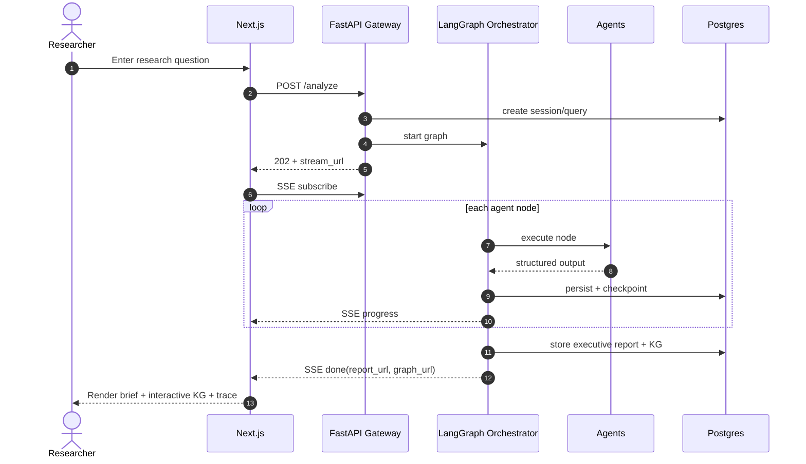

### 12.2 Agent orchestration (internal DAG with recovery)

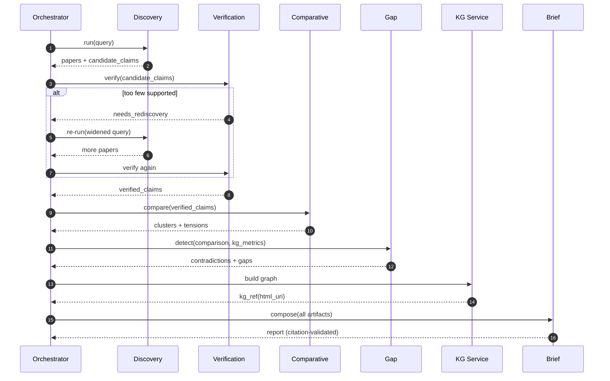

### 12.3 Claim verification

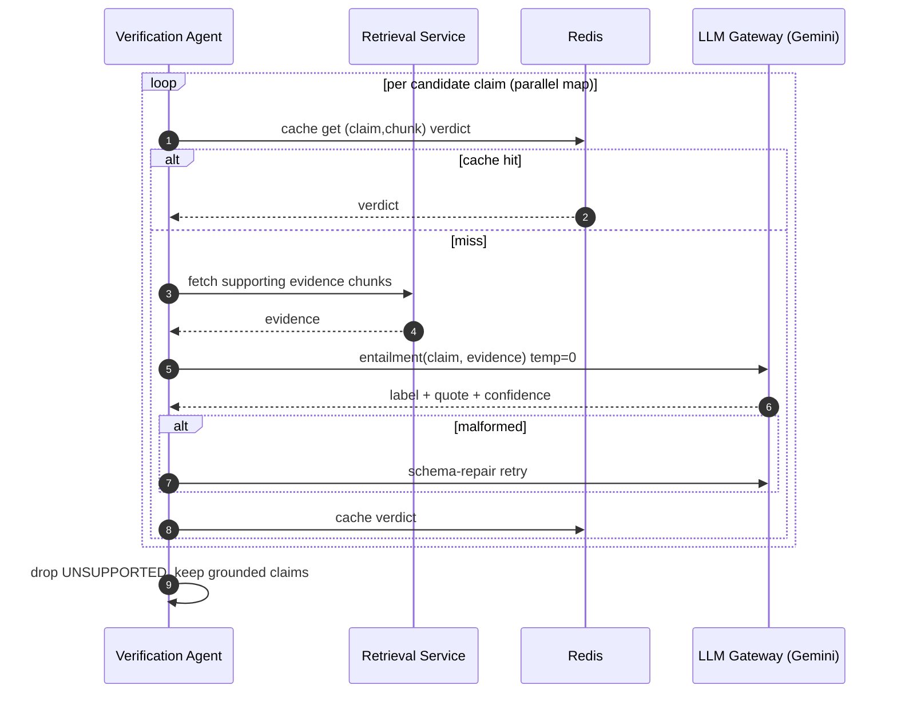

### 12.4 Knowledge graph generation

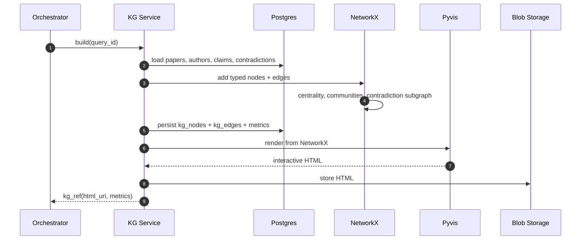

### 12.5 Executive report generation

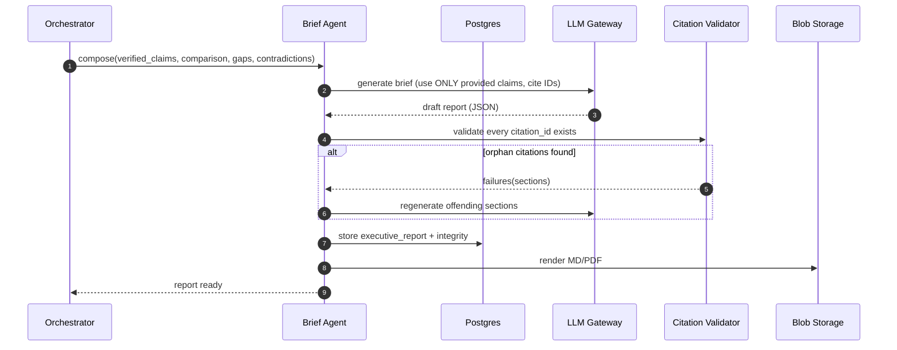

---

## SECTION 13 — Risk Analysis

| # | Risk | Likelihood × Impact | Mitigation |
|---|---|---|---|
| 1 | **Hallucination** (fabricated facts/citations) | Med × Critical | Independent Verification agent at temp 0; claim-level grounding as a data contract; deterministic citation validator on the brief; drop-not-rephrase policy; surface `verification_unsupported_ratio` metric. |
| 2 | **Orphan / wrong citations** | Med × High | Every claim links to `source_chunk_id`; brief regenerated if any citation ID is orphaned; references built from DB, not from LLM. |
| 3 | **Retrieval failure / low recall** (miss the key paper) | Med × High | Multi-query expansion; hybrid dense+lexical+rerank; cyclic re-discovery when too few claims survive; relax filters fallback. |
| 4 | **Retrieval poisoning** (irrelevant chunks) | Med × Med | Reranker + similarity thresholds; section-aware weighting; verification filters noise downstream. |
| 5 | **Agent failure / malformed output** | Med × Med | Per-node retries + schema-repair; fail-safe defaults; non-critical nodes degrade gracefully (partial result). |
| 6 | **External API failure** (Semantic Scholar/arXiv down or rate-limited) | High × Med | Per-source timeout + backoff; one-source degradation; cache connector responses; FAISS-only fallback over ingested corpus. |
| 7 | **LLM (Gemini) unavailability / rate limit / cost spike** | Med × High | LLM gateway with retries, circuit breaker, concurrency limit, token-budget guard, response caching; queue + coalesce requests; (optional) smaller model fallback for non-critical steps. |
| 8 | **Database failure** | Low × Critical | Azure PG HA zone-redundant + PITR backups; connection pooling; idempotent writes; checkpoints survive in Redis+PG. |
| 9 | **Latency bottlenecks** (long multi-agent runs) | High × Med | Parallel map in Verification; aggressive caching; async + SSE so UX feels responsive; precompute demo corpus; reranker only on small top-N. |
| 10 | **Scalability** (many concurrent sessions / large corpus) | Med × Med | Stateless agents + horizontal autoscale; KEDA workers; FAISS replication/sharding; PG read replicas; Redis-backed queue. |
| 11 | **Checkpoint/state corruption** | Low × High | Append-only reducers; idempotent node writes; versioned checkpoints; resume-from-last-good. |
| 12 | **Prompt drift / quality regression** | Med × Med | Versioned prompts + `tests/eval` grounding accuracy harness in CI; track unsupported ratio over time. |
| 13 | **Security / data leakage / prompt injection from paper content** | Med × High | Treat paper text as untrusted data, not instructions; sandboxed KG iframe; RBAC + tenant isolation; Key Vault + Managed Identity; WAF. |
| 14 | **Cost overrun during demo** | Med × Med | Global token budget guard; cache everything; precompute heavy artifacts; scale-to-zero workers. |

---

## SECTION 14 — Top 10 Buildathon Strategy

> Goal: be one of the 10/100. Judges reward **a working, differentiated, trustworthy demo with enterprise polish** — not feature count.

### 14.1 The winning narrative (say this out loud)

> "Everyone built a RAG chatbot. We built a **research intelligence system that verifies every claim, detects contradictions, and finds research gaps** — with full citation traceability and an enterprise-grade, Azure-ready, observable multi-agent architecture Capgemini could ship."

### 14.2 Feature classification

**Mandatory (must work live — these define the category):**
1. Discovery + hybrid retrieval over real Semantic Scholar/arXiv data.
2. **Claim verification with citations** (the trust differentiator).
3. **Contradiction + research gap detection** (the unique differentiator).
4. **Executive brief with inline, clickable citations** (the deliverable).
5. **Interactive knowledge graph** (the visual wow).
6. **Live agent trace / explainability panel** (proves multi-agent + observability).

**Optional (nice if time permits):**
- PDF upload for private papers.
- Multi-turn session memory / follow-up questions.
- Cross-encoder reranking, self-consistency verification.
- PDF export of brief, author co-authorship sub-graph.

**Skip / don't build:** generic chat UI, auth flows beyond a stub, extra agents, fine-tuning, exotic vector DBs.

### 14.3 What impresses judges most (ranked by impact)

| Rank | Element | Why it wins |
|---|---|---|
| 1 | **Contradiction detection visualized in the KG** (red edges) | Nobody else has it; instantly memorable; screams "intelligence not search." |
| 2 | **Claim-level grounding** — click a brief sentence → highlights exact source span | Solves the #1 enterprise fear (hallucination); demonstrably trustworthy. |
| 3 | **Research gap discovery with rationale** | Highest *business value*; "this finds you your next research direction." |
| 4 | **Live multi-agent trace** with per-agent timing/tokens | Proves real LangGraph orchestration + observability (Capgemini criterion). |
| 5 | **Interactive knowledge graph** | Visual, explorable, beautiful. |
| 6 | **Azure architecture + observability story** | Wins the "production readiness / enterprise" axis. |

### 14.4 Live vs precomputed vs mocked

**Demonstrate live:**
- Submit one *prepared* research question → watch the agent trace stream → brief + KG appear.
- Click a claim → jump to source span (grounding).
- Open the contradiction in the KG.
- One *fresh, judge-suggested* query to prove it's real (have a fast path / smaller k).

**Precompute (for speed/reliability):**
- Ingest + embed a curated corpus (1–3 hot topics, e.g., "RAG methods", "MoE efficiency") before the demo so retrieval is instant.
- Pre-build the FAISS index + a cached "hero" brief and KG as a fallback if the network dies.
- Warm caches for the hero query.

**Acceptable to mock:**
- Auth/login (stub a logged-in user).
- Multi-tenant org switching.
- Email/notifications, billing.
- PDF export styling (basic is fine).

**NEVER mock:**
- Claim verification logic and citation links (this is the whole thesis — faking it is disqualifying if caught).
- Contradiction/gap detection results.
- The retrieval over real paper sources for the hero topic.
- The agent execution (must be real LangGraph, not a scripted animation).

### 14.5 Demo script (≈4 minutes)

1. **(20s) Frame the problem** — "researchers drown in papers; existing tools retrieve, they don't reason."
2. **(60s) Run hero query** — show the **live agent trace** streaming (Discovery→Verification→…). Narrate what each agent does.
3. **(60s) Open the brief** — click a key finding → highlight exact source span. "Every sentence is grounded."
4. **(45s) Show the KG** — point to the red **contradiction** edge between two papers; explain.
5. **(30s) Show a research gap** with its rationale. "This is your next paper."
6. **(20s) Fresh judge query** — prove it's live.
7. **(25s) Architecture slide** — Azure + OTel + LangGraph; "Capgemini-deployable today."

### 14.6 Build priority order (time-boxed)

1. Connectors + embedding + FAISS + hybrid retrieval (foundation).
2. LangGraph skeleton with the 5 nodes + shared state + SSE streaming (proves orchestration early).
3. Verification + grounding contract (the differentiator core).
4. Brief generation + citation validator (the deliverable).
5. Gap/contradiction detection (the wow).
6. KG (NetworkX + Pyvis) (the visual).
7. Frontend polish: agent trace, brief viewer with click-to-source, KG embed.
8. Observability dashboard + Azure deploy proof (enterprise axis).
9. Precompute hero corpus + warm caches + fallback artifacts (demo safety).

### 14.7 Risk-proofing the demo

- **Always have a precomputed fallback** brief + KG for the hero query (network/LLM outage insurance).
- Cap `k` and use cached embeddings for live queries → fast, predictable latency.
- Token-budget guard so you don't exhaust Gemini quota mid-judging.
- Rehearse the exact script; have the fresh-query path tested on 3 backup topics.

---

### Final positioning statement

SynaptiQ ResearchOS is not a chatbot over papers — it is a **grounded, observable, multi-agent research intelligence platform** that verifies claims, exposes contradictions, and discovers gaps, packaged in a modular, Azure-ready architecture with enterprise-grade explainability. That combination — *trust + differentiation + production readiness* — is precisely what moves a team from 100 to the final 10.
