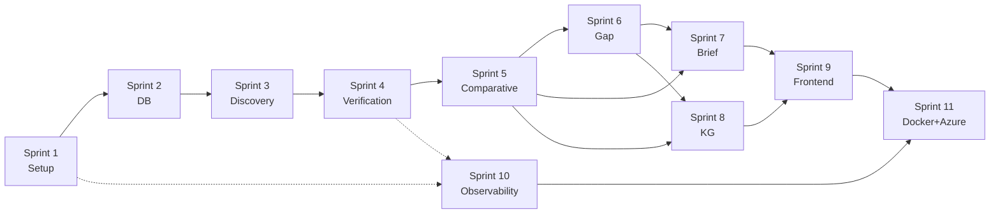

# SynaptiQ ResearchOS — Sprint Board (Jira-style)

> Derived from `ARCHITECTURE_BLUEPRINT.md` + `TECHNICAL_SPECIFICATION.md`
> Each ticket is sized for a single Cursor Composer pass (< 300 LOC), independent, with explicit dependencies.
> Ticket prefix `SQ-`. Status workflow: `TODO → IN PROGRESS → IN REVIEW → DONE`.

## Legend

- **Story Points (SP):** 1 ≈ <1h, 2 ≈ ~2h, 3 ≈ ~4h, 5 ≈ ~1 day.
- **Priority:** P0 (critical path) … P3 (nice-to-have).
- **Dependencies:** ticket IDs that must be DONE first. "—" = none.
- Every ticket: typed, docstringed, unit-tested, OTel-instrumented where it does I/O, no secrets, passes ruff + mypy.

## Board Index

| Sprint | Theme | Tickets | Focus |
|---|---|---|---|
| 1 | Project setup | SQ-101 … SQ-110 | Skeleton, config, CI, health |
| 2 | Database | SQ-201 … SQ-214 | Models, migrations, repos |
| 3 | Discovery Agent | SQ-301 … SQ-312 | Sources, LLM, state, discovery |
| 4 | Verification Agent | SQ-401 … SQ-412 | Chunk, embed, FAISS, retrieve, verify |
| 5 | Comparative Analysis | SQ-501 … SQ-507 | Clustering, relations, contradictions |
| 6 | Gap Detection | SQ-601 … SQ-605 | Coverage matrix, gaps |
| 7 | Executive Brief | SQ-701 … SQ-707 | Brief, citation integrity, SSE |
| 8 | Knowledge Graph | SQ-801 … SQ-808 | NetworkX, analytics, Pyvis, routes |
| 9 | Frontend | SQ-901 … SQ-912 | Next.js UI, SSE, viewers |
| 10 | Observability | SQ-1001 … SQ-1008 | Tracing, metrics, logs, audit |
| 11 | Docker + Azure | SQ-1101 … SQ-1110 | Containers, IaC, CI/CD, alerts |

---

## SPRINT 1 — Project Setup

**Goal:** runnable backend skeleton, CI green, health endpoints, local compose. **Exit:** `docker-compose up` healthy + CI passing.

### SQ-101 — Repo scaffold & pyproject
- **Objective:** Initialize backend package layout and tooling (ruff, mypy, pytest).
- **Files affected:** `backend/pyproject.toml`, `backend/app/__init__.py`, `backend/README.md`, `.gitignore`.
- **Functions:** —
- **Classes:** —
- **Inputs:** none. **Outputs:** installable package, configured linters.
- **Dependencies:** —
- **Test cases:** `pytest` collects 0 tests without error; `ruff check` + `mypy app` exit 0.
- **Acceptance criteria:** `pip install -e .` works; tool configs present; Python 3.11 pinned.
- **SP:** 2 · **Priority:** P0

### SQ-102 — Settings/config module
- **Objective:** Typed settings from env (+Key Vault later).
- **Files affected:** `app/core/config.py`, `.env.example`.
- **Functions:** `get_settings()` (lru_cache).
- **Classes:** `Settings(BaseSettings)`.
- **Inputs:** env vars (DB url, Redis url, Gemini key, JWT secret). **Outputs:** `Settings` singleton.
- **Dependencies:** SQ-101
- **Test cases:** defaults load; env override works; missing required → ValidationError.
- **Acceptance criteria:** no literals/secrets elsewhere; `.env.example` lists all keys.
- **SP:** 2 · **Priority:** P0

### SQ-103 — Exception hierarchy
- **Objective:** Central typed exceptions.
- **Files affected:** `app/core/exceptions.py`.
- **Classes:** `SynaptiqError`, `UpstreamError`, `AgentError`, `InsufficientEvidenceError`, `ValidationError`, `AuthError`, `RateLimitError`.
- **Inputs:** message/details. **Outputs:** exceptions carrying `code`, `type`, `retryable`.
- **Dependencies:** SQ-101
- **Test cases:** each maps to expected `code`/`type`/`retryable`.
- **Acceptance criteria:** all inherit `SynaptiqError`; importable everywhere.
- **SP:** 1 · **Priority:** P0

### SQ-104 — Error envelope schema + handlers
- **Objective:** Standard error response + FastAPI handlers.
- **Files affected:** `app/schemas/errors.py`, `app/api/errors.py`.
- **Functions:** `register_exception_handlers(app)`.
- **Classes:** `ErrorEnvelope`, `ErrorDetail`.
- **Inputs:** raised exception. **Outputs:** JSON envelope + status + `trace_id`.
- **Dependencies:** SQ-103
- **Test cases:** each exception → correct status/envelope; unknown → 500 generic.
- **Acceptance criteria:** no stack traces leaked; envelope matches spec §6.4.
- **SP:** 2 · **Priority:** P0

### SQ-105 — Structured logging
- **Objective:** JSON logger with correlation binding.
- **Files affected:** `app/monitoring/logging.py`.
- **Functions:** `get_logger(name)`, `bind(correlation_id, **kw)`.
- **Classes:** `JsonFormatter`.
- **Inputs:** log records. **Outputs:** single-line JSON logs.
- **Dependencies:** SQ-101
- **Test cases:** output parses as JSON; includes correlation_id; no PII fields.
- **Acceptance criteria:** levels DEBUG/INFO/WARN/ERROR; used by app.
- **SP:** 2 · **Priority:** P0

### SQ-106 — Tracing init (console exporter dev)
- **Objective:** OTel SDK + decorator.
- **Files affected:** `app/monitoring/tracing.py`.
- **Functions:** `init_tracing(app)`, `traced(name)` decorator, `get_tracer()`.
- **Classes:** —
- **Inputs:** app. **Outputs:** spans to console (dev).
- **Dependencies:** SQ-101
- **Test cases:** decorated fn creates a span; trace_id retrievable.
- **Acceptance criteria:** auto-instruments FastAPI when wired.
- **SP:** 2 · **Priority:** P0

### SQ-107 — App factory + lifespan
- **Objective:** FastAPI app with lifespan resource mgmt.
- **Files affected:** `app/main.py`.
- **Functions:** `create_app()`, `lifespan(app)`.
- **Classes:** —
- **Inputs:** settings. **Outputs:** `app`.
- **Dependencies:** SQ-102, SQ-104, SQ-105, SQ-106
- **Test cases:** app boots; lifespan opens/closes mocked resources.
- **Acceptance criteria:** `uvicorn app.main:app` runs; middleware order tracing→error→auth→ratelimit→cache (stubs ok).
- **SP:** 2 · **Priority:** P0

### SQ-108 — Health/readiness/metrics routes
- **Objective:** Liveness/readiness endpoints.
- **Files affected:** `app/api/v1/routes_health.py`.
- **Functions:** `handler_get_health`, `handler_get_ready`, `handler_get_metrics`.
- **Classes:** —
- **Inputs:** none. **Outputs:** 200 status JSON; `/ready` checks DB+Redis (mock now).
- **Dependencies:** SQ-107
- **Test cases:** health 200; ready 503 when dep down (mocked).
- **Acceptance criteria:** registered under `/api/v1`.
- **SP:** 1 · **Priority:** P0

### SQ-109 — Local docker-compose
- **Objective:** Dev stack: api, postgres, redis, otel-collector.
- **Files affected:** `docker/docker-compose.yml`, `docker/backend.Dockerfile`, `docker/otel-collector.yaml`.
- **Functions:** — **Classes:** —
- **Inputs:** env. **Outputs:** local stack.
- **Dependencies:** SQ-107
- **Test cases:** `docker-compose up` → all healthy; `/health` reachable.
- **Acceptance criteria:** non-root image; healthchecks defined.
- **SP:** 3 · **Priority:** P0

### SQ-110 — CI pipeline (lint/type/test)
- **Objective:** PR gate.
- **Files affected:** `deployment/pipelines/ci.yml`.
- **Functions:** — **Classes:** —
- **Inputs:** PR. **Outputs:** pass/fail + coverage.
- **Dependencies:** SQ-101
- **Test cases:** failing lint/type/test fails pipeline.
- **Acceptance criteria:** runs ruff + mypy + pytest + coverage threshold.
- **SP:** 2 · **Priority:** P0

---

## SPRINT 2 — Database

**Goal:** full schema, migrations, repositories. **Exit:** migrations apply on testcontainer; repos covered ≥80%.

### SQ-201 — Base + mixins
- **Objective:** Declarative base + reusable mixins.
- **Files affected:** `app/database/base.py`.
- **Classes:** `Base`, `UUIDMixin`, `TimestampMixin`, `SoftDeleteMixin`.
- **Inputs:** — **Outputs:** mixin columns (id, created_at, updated_at, deleted_at).
- **Dependencies:** SQ-101
- **Test cases:** mixin columns present; UUID default; timestamps server_default.
- **Acceptance criteria:** importable by all models.
- **SP:** 2 · **Priority:** P0

### SQ-202 — Enums
- **Objective:** All domain enums.
- **Files affected:** `app/models/enums.py`.
- **Classes:** `Verdict`, `RelationType`, `GapType`, `NodeType`, `EdgeType`, `JobStatus`, `AgentName`, `UserRole`, `PaperSourceType`.
- **Inputs:** — **Outputs:** string-backed enums.
- **Dependencies:** SQ-101
- **Test cases:** values stable; string round-trip.
- **Acceptance criteria:** reused by models + schemas.
- **SP:** 1 · **Priority:** P0

### SQ-203 — Common Pydantic schemas
- **Objective:** Shared value objects.
- **Files affected:** `app/schemas/common.py`.
- **Classes:** `Span`, `PaperRef`, `Citation`, `Pagination`, `ScoredSpan`.
- **Inputs:** — **Outputs:** validated models.
- **Dependencies:** SQ-202
- **Test cases:** range validation (scores 0..1); serialization round-trip.
- **Acceptance criteria:** matches spec §2.2.
- **SP:** 2 · **Priority:** P0

### SQ-204 — Models: users, research_sessions
- **Objective:** Identity + session ORM.
- **Files affected:** `app/database/models/user.py`, `app/database/models/session.py`.
- **Classes:** `User`, `ResearchSession`.
- **Inputs:** — **Outputs:** mapped tables + relationships.
- **Dependencies:** SQ-201, SQ-202
- **Test cases:** unique(email); FK user→session; soft delete on user.
- **Acceptance criteria:** indexes per spec §5.3.
- **SP:** 2 · **Priority:** P0

### SQ-205 — Models: queries
- **Objective:** Query ORM.
- **Files affected:** `app/database/models/query.py`.
- **Classes:** `Query`.
- **Inputs:** — **Outputs:** mapped table.
- **Dependencies:** SQ-204
- **Test cases:** FK session; idx(normalized_hash, status); JSONB filters.
- **Acceptance criteria:** relationships to children declared.
- **SP:** 2 · **Priority:** P0

### SQ-206 — Models: papers, retrieval_results
- **Objective:** Paper catalog + junction.
- **Files affected:** `app/database/models/paper.py`, `app/database/models/retrieval_result.py`.
- **Classes:** `Paper`, `RetrievalResult`.
- **Inputs:** — **Outputs:** mapped tables.
- **Dependencies:** SQ-205
- **Test cases:** unique(external_id); GIN FTS index; unique(query_id,paper_id).
- **Acceptance criteria:** M:N wired via RetrievalResult.
- **SP:** 3 · **Priority:** P0

### SQ-207 — Models: verified_claims
- **Objective:** Claim ORM.
- **Files affected:** `app/database/models/verified_claim.py`.
- **Classes:** `VerifiedClaim`.
- **Inputs:** — **Outputs:** mapped table.
- **Dependencies:** SQ-206
- **Test cases:** CHECK confidence 0..1; verdict enum; idx(verdict,topic).
- **Acceptance criteria:** supporting_spans JSONB.
- **SP:** 2 · **Priority:** P0

### SQ-208 — Models: comparative_analysis
- **Objective:** Relation ORM.
- **Files affected:** `app/database/models/comparative_analysis.py`.
- **Classes:** `ComparativeAnalysis`.
- **Inputs:** — **Outputs:** mapped table with two claim FKs.
- **Dependencies:** SQ-207
- **Test cases:** FK claim_a/claim_b; relation_type enum; idx(relation_type).
- **Acceptance criteria:** self-referential FKs resolve.
- **SP:** 2 · **Priority:** P0

### SQ-209 — Models: research_gaps, executive_reports
- **Objective:** Gap + report ORM.
- **Files affected:** `app/database/models/research_gap.py`, `app/database/models/executive_report.py`.
- **Classes:** `ResearchGap`, `ExecutiveReport`.
- **Inputs:** — **Outputs:** mapped tables.
- **Dependencies:** SQ-205
- **Test cases:** gap_type enum; report content JSONB; soft delete on report.
- **Acceptance criteria:** idx(impact_score), idx(session_id).
- **SP:** 2 · **Priority:** P0

### SQ-210 — Models: kg_nodes, kg_edges
- **Objective:** Knowledge graph ORM.
- **Files affected:** `app/database/models/kg_node.py`, `app/database/models/kg_edge.py`.
- **Classes:** `KGNode`, `KGEdge`.
- **Inputs:** — **Outputs:** mapped tables.
- **Dependencies:** SQ-205
- **Test cases:** node_type/edge_type enums; unique(query_id,node_key); FK source/target.
- **Acceptance criteria:** edges reference nodes.
- **SP:** 2 · **Priority:** P0

### SQ-211 — Models: agent_logs, system_metrics
- **Objective:** Observability ORM.
- **Files affected:** `app/database/models/agent_log.py`, `app/database/models/system_metric.py`.
- **Classes:** `AgentLog`, `SystemMetric`.
- **Inputs:** — **Outputs:** mapped tables.
- **Dependencies:** SQ-205
- **Test cases:** idx(trace_id, agent_name); metrics idx(metric_name, recorded_at).
- **Acceptance criteria:** append-only usage (no updates) documented.
- **SP:** 2 · **Priority:** P1

### SQ-212 — DB session + engine + get_db
- **Objective:** Async engine, sessionmaker, DI provider.
- **Files affected:** `app/database/session.py`, `app/api/deps.py`.
- **Functions:** `get_session()`, `get_db()`.
- **Classes:** —
- **Inputs:** DB url. **Outputs:** async session.
- **Dependencies:** SQ-201
- **Test cases:** session yields; rollback on exception; pool configured.
- **Acceptance criteria:** usable in routes/repos.
- **SP:** 2 · **Priority:** P0

### SQ-213 — Alembic + first migration
- **Objective:** Migration tooling + initial schema.
- **Files affected:** `backend/alembic.ini`, `app/database/migrations/env.py`, `app/database/migrations/versions/0001_init.py`.
- **Functions:** `upgrade()`, `downgrade()`.
- **Classes:** —
- **Inputs:** model metadata. **Outputs:** schema.
- **Dependencies:** SQ-204…SQ-211
- **Test cases:** upgrade head + downgrade base on testcontainer Postgres.
- **Acceptance criteria:** autogenerate matches models (no drift).
- **SP:** 3 · **Priority:** P0

### SQ-214 — Base + concrete repositories
- **Objective:** Data-access layer.
- **Files affected:** `app/database/repositories/base_repo.py`, `paper_repo.py`, `claim_repo.py`, `session_repo.py`, `report_repo.py`.
- **Functions:** `create/get/list/update/soft_delete`, `get_paper_by_external_id`, `upsert_paper`, `list_claims_by_query`.
- **Classes:** `BaseRepository[T]`, `PaperRepository`, `ClaimRepository`, `SessionRepository`, `ReportRepository`.
- **Inputs:** models/filters. **Outputs:** persisted rows.
- **Dependencies:** SQ-212, SQ-213
- **Test cases:** CRUD; soft-delete filter; dedup upsert by external_id.
- **Acceptance criteria:** ≥80% coverage (testcontainers).
- **SP:** 5 · **Priority:** P0

---

## SPRINT 3 — Discovery Agent

**Goal:** question → ranked, deduped papers via LangGraph node. **Exit:** discovery node runs on cassette + persists papers.

### SQ-301 — Agent I/O schemas
- **Objective:** Pydantic models for all agent payloads.
- **Files affected:** `app/schemas/agent_io.py`.
- **Classes:** `DiscoveryOutput`, `VerifiedClaim`, `ClusterRelation`, `ResearchGap`, `ExecutiveReport`, `AgentMessage`, `AgentError`, `KGMeta`, `ControlState`, `SessionInfo`.
- **Inputs:** — **Outputs:** validated schemas.
- **Dependencies:** SQ-203
- **Test cases:** enum + range validation; serialization.
- **Acceptance criteria:** matches spec §2.2.
- **SP:** 3 · **Priority:** P0

### SQ-302 — ResearchState + reducers
- **Objective:** LangGraph state object.
- **Files affected:** `app/graphs/state.py`.
- **Functions:** `merge_papers`, `merge_claims`.
- **Classes:** `ResearchState` (TypedDict).
- **Inputs:** deltas. **Outputs:** merged state.
- **Dependencies:** SQ-301
- **Test cases:** papers dedup by id (keep max score); claims dedup; append fields concat.
- **Acceptance criteria:** state JSON-serializable for checkpoint.
- **SP:** 3 · **Priority:** P0

### SQ-303 — LLM protocol + GeminiClient
- **Objective:** Structured-output LLM wrapper.
- **Files affected:** `app/services/llm/gemini_client.py`, `app/services/llm/base.py`.
- **Functions:** `generate_structured(prompt, schema, temperature)`, `_with_retry`.
- **Classes:** `LLMProtocol`, `GeminiClient`.
- **Inputs:** prompt + Pydantic schema. **Outputs:** validated instance + token usage.
- **Dependencies:** SQ-102, SQ-103
- **Test cases (FakeGemini):** valid JSON parsed; malformed → repair-retry; timeout → retry then `UpstreamError`.
- **Acceptance criteria:** never returns unvalidated dict; tokens recorded.
- **SP:** 3 · **Priority:** P0

### SQ-304 — Prompt loader
- **Objective:** Load versioned YAML prompts.
- **Files affected:** `app/prompts/loader.py`.
- **Functions:** `load_prompt(name, version)`.
- **Classes:** `PromptTemplate`.
- **Inputs:** name/version. **Outputs:** template (system/instructions/few_shot/schema).
- **Dependencies:** SQ-101
- **Test cases:** loads existing; missing key → error; version honored.
- **Acceptance criteria:** prompts decoupled from code.
- **SP:** 2 · **Priority:** P0

### SQ-305 — Discovery prompt YAML
- **Objective:** Production discovery prompt.
- **Files affected:** `app/prompts/discovery.yaml`.
- **Functions:** — **Classes:** —
- **Inputs:** — **Outputs:** system + instructions + few-shot + JSON constraints.
- **Dependencies:** SQ-304
- **Test cases:** loader parses; contains grounding + anti-injection rules.
- **Acceptance criteria:** matches spec §4.1.
- **SP:** 2 · **Priority:** P0

### SQ-306 — Source base + Semantic Scholar connector
- **Objective:** Normalized SS search.
- **Files affected:** `app/services/sources/base_source.py`, `app/services/sources/semantic_scholar.py`.
- **Functions:** `search(query, filters)`, retry+backoff, circuit breaker.
- **Classes:** `PaperSource`, `SemanticScholarSource`.
- **Inputs:** query + filters. **Outputs:** `list[PaperRef]`.
- **Dependencies:** SQ-203, SQ-303
- **Test cases (respx):** parse→PaperRef; timeout→retry; breaker opens after N failures.
- **Acceptance criteria:** normalized output; no raw dicts leaked.
- **SP:** 3 · **Priority:** P0

### SQ-307 — arXiv connector
- **Objective:** Normalized arXiv search.
- **Files affected:** `app/services/sources/arxiv.py`.
- **Functions:** `search(query, filters)`.
- **Classes:** `ArxivSource`.
- **Inputs:** query. **Outputs:** `list[PaperRef]`.
- **Dependencies:** SQ-306
- **Test cases (respx):** XML parse→PaperRef; error→retry.
- **Acceptance criteria:** same interface as base source.
- **SP:** 3 · **Priority:** P0

### SQ-308 — BaseAgent
- **Objective:** Abstract agent with retry/parse/log.
- **Files affected:** `app/agents/base.py`.
- **Functions:** `run(state)`, `_invoke_llm`, `_parse_and_validate`, `_with_retry`, `_log`, `_emit_message`.
- **Classes:** `BaseAgent(ABC)`.
- **Inputs:** state. **Outputs:** state delta.
- **Dependencies:** SQ-302, SQ-303
- **Test cases:** retry wrapper; schema validation; agent_log emitted; message appended.
- **Acceptance criteria:** subclasses only implement `run` body.
- **SP:** 3 · **Priority:** P0

### SQ-309 — DiscoveryAgent
- **Objective:** Query expansion + dedup + rank.
- **Files affected:** `app/agents/discovery_agent.py`.
- **Functions:** `run`, `_expand_queries`, `_dedup`, `_score`.
- **Classes:** `DiscoveryAgent(BaseAgent)`.
- **Inputs:** question, filters. **Outputs:** `papers[]`, `plan`, `control.sufficiency`.
- **Dependencies:** SQ-305, SQ-306, SQ-307, SQ-308
- **Test cases:** cassette→papers; one source down→partial flag; sufficiency threshold.
- **Acceptance criteria:** deduped, schema-valid; persists via paper_repo.
- **SP:** 3 · **Priority:** P0

### SQ-310 — Checkpointer
- **Objective:** LangGraph checkpoint backend.
- **Files affected:** `app/graphs/checkpointer.py`.
- **Functions:** `get_checkpointer()`.
- **Classes:** —
- **Inputs:** config. **Outputs:** checkpoint saver (Postgres + Redis hot).
- **Dependencies:** SQ-212
- **Test cases:** save/load state; key by (session,query,thread).
- **Acceptance criteria:** resume from checkpoint works.
- **SP:** 3 · **Priority:** P0

### SQ-311 — Single-node graph (discovery only)
- **Objective:** Minimal compiled graph.
- **Files affected:** `app/graphs/research_graph.py`.
- **Functions:** `build_research_graph()`, `node_discovery(state)`.
- **Classes:** —
- **Inputs:** state. **Outputs:** state with papers.
- **Dependencies:** SQ-309, SQ-310
- **Test cases:** invoke graph → papers populated; checkpoint written.
- **Acceptance criteria:** runs end-to-end on cassette.
- **SP:** 3 · **Priority:** P0

### SQ-312 — Test fixtures: FakeGemini + recorded sources
- **Objective:** Offline test doubles.
- **Files affected:** `tests/fixtures/fake_gemini.py`, `tests/fixtures/cassettes/*`, `tests/fixtures/__init__.py`.
- **Functions:** `make_fake_gemini(responses)`.
- **Classes:** `FakeGemini(LLMProtocol)`.
- **Inputs:** scripted responses. **Outputs:** deterministic LLM/source replies.
- **Dependencies:** SQ-303, SQ-306
- **Test cases:** returns scripted structured output; no network in CI.
- **Acceptance criteria:** all agent tests run offline.
- **SP:** 3 · **Priority:** P0

---

## SPRINT 4 — Verification Agent

**Goal:** papers → grounded verified claims (hybrid retrieval). **Exit:** no-span→UNSUPPORTED enforced; claims persisted.

### SQ-401 — Structure-aware chunker
- **Objective:** Section-respecting chunking with span offsets.
- **Files affected:** `app/services/chunking/chunker.py`.
- **Functions:** `chunk(paper)`.
- **Classes:** `StructureAwareChunker`, `Chunk`.
- **Inputs:** PaperRef/text. **Outputs:** `list[Chunk]` with span offsets.
- **Dependencies:** SQ-203
- **Test cases:** respects sections; size+overlap; no mid-sentence split; offsets correct.
- **Acceptance criteria:** spans map to char ranges.
- **SP:** 3 · **Priority:** P0

### SQ-402 — Embedder + content-hash cache
- **Objective:** Sentence-Transformer embeddings off event loop.
- **Files affected:** `app/services/embeddings/embedder.py`.
- **Functions:** `embed_texts(texts)`, `_cache_key`.
- **Classes:** `Embedder`.
- **Inputs:** list[str]. **Outputs:** normalized vectors.
- **Dependencies:** SQ-102 (model name), SQ-413? (no) → SQ-102
- **Test cases (FakeEmbedder):** cache hit skips compute; shape/normalization correct; runs in executor.
- **Acceptance criteria:** never blocks event loop.
- **SP:** 3 · **Priority:** P0

### SQ-403 — FaissStore
- **Objective:** Vector index add/search/persist.
- **Files affected:** `app/vector_store/faiss_store.py`.
- **Functions:** `add(ids, vectors)`, `search(vector, k)`, `save`, `load`.
- **Classes:** `FaissStore`.
- **Inputs:** vectors+ids. **Outputs:** neighbors+scores.
- **Dependencies:** SQ-402
- **Test cases:** add→search returns known neighbor; persist/reload; cosine via IP.
- **Acceptance criteria:** per-session namespace supported.
- **SP:** 3 · **Priority:** P0

### SQ-404 — Index manager
- **Objective:** Index lifecycle + type selection.
- **Files affected:** `app/vector_store/index_manager.py`.
- **Functions:** `load_on_startup`, `snapshot_to_blob`, `select_index_type(n)`.
- **Classes:** `IndexManager`.
- **Inputs:** corpus size. **Outputs:** index instance.
- **Dependencies:** SQ-403
- **Test cases:** flat for small, IVF/HNSW for large; snapshot/restore.
- **Acceptance criteria:** wired into lifespan.
- **SP:** 2 · **Priority:** P1

### SQ-405 — RRF fusion
- **Objective:** Merge dense+sparse rankings.
- **Files affected:** `app/services/retrieval/fusion.py`.
- **Functions:** `reciprocal_rank_fusion(rankings, k)`.
- **Classes:** —
- **Inputs:** ranked lists. **Outputs:** fused ranking.
- **Dependencies:** SQ-203
- **Test cases:** known inputs → expected fused order; ties stable.
- **Acceptance criteria:** deterministic.
- **SP:** 2 · **Priority:** P0

### SQ-406 — Cross-encoder reranker
- **Objective:** Precision re-rank of candidates.
- **Files affected:** `app/services/retrieval/reranker.py`.
- **Functions:** `rerank(query, candidates)`.
- **Classes:** `CrossEncoderReranker`.
- **Inputs:** query + candidate spans. **Outputs:** reordered spans.
- **Dependencies:** SQ-402
- **Test cases (fake model):** reorders by score; runs in executor.
- **Acceptance criteria:** top-N returned.
- **SP:** 3 · **Priority:** P1

### SQ-407 — Hybrid retriever
- **Objective:** Compose FAISS + FTS + fusion + rerank.
- **Files affected:** `app/services/retrieval/hybrid_retriever.py`.
- **Functions:** `retrieve(query, k)`.
- **Classes:** `HybridRetriever`.
- **Inputs:** query. **Outputs:** `list[ScoredSpan]`.
- **Dependencies:** SQ-403, SQ-405, SQ-406
- **Test cases:** combines both sources; empty corpus → []; ranking deterministic on fixtures.
- **Acceptance criteria:** returns spans with provenance.
- **SP:** 3 · **Priority:** P0

### SQ-408 — Verification prompts YAML (2-stage)
- **Objective:** Claim-extraction + NLI verify prompts.
- **Files affected:** `app/prompts/verification.yaml`.
- **Functions:** — **Classes:** —
- **Inputs:** — **Outputs:** stage A + stage B prompts.
- **Dependencies:** SQ-304
- **Test cases:** loader parses; contains "no span→UNSUPPORTED" + no-outside-knowledge rules.
- **Acceptance criteria:** matches spec §4.2.
- **SP:** 2 · **Priority:** P0

### SQ-409 — Claim verdict cache
- **Objective:** Redis cache for verdicts.
- **Files affected:** `app/cache/redis_client.py`, `app/cache/keys.py`, `app/cache/cache_service.py`.
- **Functions:** key builders, `get/set`, `cached` decorator.
- **Classes:** `CacheService`.
- **Inputs:** claim hash. **Outputs:** cached VerifiedClaim.
- **Dependencies:** SQ-102
- **Test cases:** hit/miss; TTL+jitter; key includes model/prompt version.
- **Acceptance criteria:** keys per spec §8.
- **SP:** 3 · **Priority:** P0

### SQ-410 — VerificationAgent
- **Objective:** Extract + ground-verify claims.
- **Files affected:** `app/agents/verification_agent.py`.
- **Functions:** `run`, `_extract_claims`, `_verify_claim`, `_score_confidence`.
- **Classes:** `VerificationAgent(BaseAgent)`.
- **Inputs:** papers, chunks. **Outputs:** `claims[]`, `avg_confidence`, `unsupported_ratio`.
- **Dependencies:** SQ-401, SQ-407, SQ-408, SQ-409, SQ-308
- **Test cases:** no spans→UNSUPPORTED(no_evidence); supported case; confidence formula; cache hit; parse fail→quarantine.
- **Acceptance criteria:** every claim has spans or UNSUPPORTED; persists claims.
- **SP:** 5 · **Priority:** P0

### SQ-411 — Index node + verification node + routing
- **Objective:** Wire indexing + verification into graph.
- **Files affected:** `app/graphs/research_graph.py`, `app/graphs/routing.py`.
- **Functions:** `node_index(state)`, `node_verification(state)`, `route_after_discovery`, `route_after_verification`.
- **Classes:** —
- **Inputs:** state. **Outputs:** state with chunks+claims; routing decisions.
- **Dependencies:** SQ-410, SQ-311
- **Test cases:** insufficient discovery→loop (bounded); low confidence→re-discover; happy path proceeds.
- **Acceptance criteria:** max_iterations enforced.
- **SP:** 3 · **Priority:** P0

### SQ-412 — Golden corpus + FakeEmbedder
- **Objective:** Deterministic test corpus + embed double.
- **Files affected:** `tests/golden/corpus.json`, `tests/golden/expectations.json`, `tests/fixtures/fake_embedder.py`.
- **Functions:** `make_fake_embedder()`.
- **Classes:** `FakeEmbedder`.
- **Inputs:** — **Outputs:** ~15–25 papers w/ known contradictions + gap.
- **Dependencies:** SQ-402
- **Test cases:** corpus loads; expected verdicts/contradictions documented.
- **Acceptance criteria:** reused by Sprints 5–7 tests + demo.
- **SP:** 3 · **Priority:** P0

---

## SPRINT 5 — Comparative Analysis Agent

**Goal:** cluster claims, label relations, detect contradictions. **Exit:** golden contradictions detected; persisted.

### SQ-501 — Claim clustering
- **Objective:** Topic clusters from claim embeddings.
- **Files affected:** `app/services/retrieval/clustering.py`.
- **Functions:** `cluster_claims(claims, threshold)`.
- **Classes:** `ClaimClusterer`.
- **Inputs:** claims. **Outputs:** clusters by topic.
- **Dependencies:** SQ-402
- **Test cases:** similar claims grouped; singletons isolated; threshold respected.
- **Acceptance criteria:** deterministic on fixtures.
- **SP:** 3 · **Priority:** P0

### SQ-502 — Comparative prompt YAML
- **Objective:** Cluster-then-relate prompt.
- **Files affected:** `app/prompts/comparative.yaml`.
- **Functions:** — **Classes:** —
- **Inputs:** — **Outputs:** relation-labeling prompt.
- **Dependencies:** SQ-304
- **Test cases:** loader parses; includes contradiction-criteria rules.
- **Acceptance criteria:** matches spec §4.3.
- **SP:** 2 · **Priority:** P0

### SQ-503 — ComparativeAgent
- **Objective:** Label pairwise relations + contradictions.
- **Files affected:** `app/agents/comparative_agent.py`.
- **Functions:** `run`, `_relate_pairs`, `_filter_contradictions`.
- **Classes:** `ComparativeAgent(BaseAgent)`.
- **Inputs:** claims. **Outputs:** `comparisons[]`.
- **Dependencies:** SQ-501, SQ-502, SQ-308
- **Test cases:** golden contradiction found; singleton→no relation; threshold (both conf≥0.6).
- **Acceptance criteria:** contradictions cite both claims; persisted.
- **SP:** 5 · **Priority:** P0

### SQ-504 — Comparative repository
- **Objective:** Persist/query comparisons.
- **Files affected:** `app/database/repositories/comparative_repo.py`.
- **Functions:** `bulk_create`, `list_by_query`, `list_contradictions`.
- **Classes:** `ComparativeRepository`.
- **Inputs:** relations. **Outputs:** rows.
- **Dependencies:** SQ-208, SQ-214
- **Test cases:** bulk insert; contradiction filter.
- **Acceptance criteria:** covered ≥80%.
- **SP:** 2 · **Priority:** P0

### SQ-505 — Comparative graph node
- **Objective:** Wire comparative into graph.
- **Files affected:** `app/graphs/research_graph.py`.
- **Functions:** `node_comparative(state)`.
- **Classes:** —
- **Inputs:** state.claims. **Outputs:** state.comparisons.
- **Dependencies:** SQ-503, SQ-411
- **Test cases:** node populates comparisons; edge to gap node.
- **Acceptance criteria:** runs after verification.
- **SP:** 2 · **Priority:** P0

### SQ-506 — Contradiction confidence/threshold util
- **Objective:** Centralize relation thresholds.
- **Files affected:** `app/core/constants.py`, `app/services/retrieval/relation_scoring.py`.
- **Functions:** `score_relation(a, b, llm_conf)`.
- **Classes:** —
- **Inputs:** two claims. **Outputs:** relation confidence.
- **Dependencies:** SQ-203
- **Test cases:** below threshold→dropped; INCONCLUSIVE path.
- **Acceptance criteria:** thresholds configurable.
- **SP:** 2 · **Priority:** P1

### SQ-507 — Comparative agent tests (golden)
- **Objective:** Regression on golden corpus.
- **Files affected:** `tests/agents/test_comparative.py`.
- **Functions:** — **Classes:** —
- **Inputs:** golden claims. **Outputs:** assertions.
- **Dependencies:** SQ-503, SQ-412
- **Test cases:** expected contradiction pairs present; no false positives beyond tolerance.
- **Acceptance criteria:** passes deterministically.
- **SP:** 2 · **Priority:** P0

---

## SPRINT 6 — Gap Detection Agent

**Goal:** coverage matrix → ranked gaps. **Exit:** golden temporal gap detected.

### SQ-601 — Coverage matrix builder
- **Objective:** Topics × dimensions matrix.
- **Files affected:** `app/services/retrieval/coverage_matrix.py`.
- **Functions:** `build_matrix(claims, papers)`.
- **Classes:** `CoverageMatrix`.
- **Inputs:** claims+papers. **Outputs:** matrix with sparse cells.
- **Dependencies:** SQ-301
- **Test cases:** empty cells flagged; temporal dimension; density computed.
- **Acceptance criteria:** deterministic structure.
- **SP:** 3 · **Priority:** P0

### SQ-602 — Gap prompt YAML
- **Objective:** Absence-reasoning prompt.
- **Files affected:** `app/prompts/gap.yaml`.
- **Functions:** — **Classes:** —
- **Inputs:** — **Outputs:** gap-detection prompt.
- **Dependencies:** SQ-304
- **Test cases:** loader parses; "no evidence is valid signal" rule present.
- **Acceptance criteria:** matches spec §4.4.
- **SP:** 2 · **Priority:** P0

### SQ-603 — GapAgent
- **Objective:** Identify + rank gaps.
- **Files affected:** `app/agents/gap_agent.py`.
- **Functions:** `run`, `_rank_gaps`.
- **Classes:** `GapAgent(BaseAgent)`.
- **Inputs:** comparisons, matrix, papers. **Outputs:** `gaps[]`.
- **Dependencies:** SQ-601, SQ-602, SQ-308
- **Test cases:** temporal gap on golden; dense→no gaps; top-N cap; each gap has evidence.
- **Acceptance criteria:** schema-valid; persisted.
- **SP:** 5 · **Priority:** P1

### SQ-604 — Gap repository + graph node
- **Objective:** Persist gaps + wire node.
- **Files affected:** `app/database/repositories/gap_repo.py`, `app/graphs/research_graph.py`.
- **Functions:** `bulk_create`, `list_by_query`, `node_gap(state)`.
- **Classes:** `GapRepository`.
- **Inputs:** gaps. **Outputs:** rows + state update.
- **Dependencies:** SQ-209, SQ-505, SQ-603
- **Test cases:** persist; node populates state.gaps.
- **Acceptance criteria:** runs after comparative.
- **SP:** 2 · **Priority:** P1

### SQ-605 — Gap agent tests (golden)
- **Objective:** Regression for gaps.
- **Files affected:** `tests/agents/test_gap.py`.
- **Functions:** — **Classes:** —
- **Inputs:** golden. **Outputs:** assertions.
- **Dependencies:** SQ-603, SQ-412
- **Test cases:** expected gap type present; ranking order stable.
- **Acceptance criteria:** deterministic pass.
- **SP:** 2 · **Priority:** P1

---

## SPRINT 7 — Executive Brief Agent

**Goal:** grounded, streamed brief with citation integrity. **Exit:** integrity 100% on golden; SSE streams.

### SQ-701 — Brief prompt YAML
- **Objective:** Grounded composition prompt.
- **Files affected:** `app/prompts/brief.yaml`.
- **Functions:** — **Classes:** —
- **Inputs:** — **Outputs:** brief prompt with citation rules.
- **Dependencies:** SQ-304
- **Test cases:** loader parses; every-sentence-cited rule present.
- **Acceptance criteria:** matches spec §4.5.
- **SP:** 2 · **Priority:** P0

### SQ-702 — Citation integrity checker
- **Objective:** Validate every citation resolves + supports.
- **Files affected:** `app/services/citation/integrity.py`.
- **Functions:** `check(report, claims)`.
- **Classes:** `CitationIntegrityChecker`, `IntegrityResult`.
- **Inputs:** draft report + claims. **Outputs:** pass/fail + offending blocks.
- **Dependencies:** SQ-301
- **Test cases:** uncited sentence flagged; bad id flagged; clean→pass.
- **Acceptance criteria:** deterministic; returns removable blocks.
- **SP:** 3 · **Priority:** P0

### SQ-703 — BriefAgent
- **Objective:** Compose + enforce integrity.
- **Files affected:** `app/agents/brief_agent.py`.
- **Functions:** `run`, `_compose`, `_regenerate_section`, `_hierarchical_summarize`.
- **Classes:** `BriefAgent(BaseAgent)`.
- **Inputs:** claims, comparisons, gaps, kg_meta. **Outputs:** `report`.
- **Dependencies:** SQ-701, SQ-702, SQ-308
- **Test cases:** uncited removed/regenerated; integrity 100% on golden; empty upstream→honest brief; token overflow→summarize.
- **Acceptance criteria:** no uncited factual claim survives; persisted.
- **SP:** 5 · **Priority:** P0

### SQ-704 — Report repository
- **Objective:** Persist/fetch reports.
- **Files affected:** `app/database/repositories/report_repo.py` (extend).
- **Functions:** `create_report`, `get_by_query`, `soft_delete`.
- **Classes:** `ReportRepository`.
- **Inputs:** report. **Outputs:** row.
- **Dependencies:** SQ-209, SQ-214
- **Test cases:** create/get; soft delete filter.
- **Acceptance criteria:** content JSONB round-trips.
- **SP:** 2 · **Priority:** P0

### SQ-705 — SSE streamer + job runner
- **Objective:** Stream agent progress + run pipeline async.
- **Files affected:** `app/services/jobs/job_runner.py`, `app/api/v1/routes_jobs.py`.
- **Functions:** `submit_job`, `get_status`, `stream(job_id)`.
- **Classes:** `JobRunner`.
- **Inputs:** job payload. **Outputs:** 202 + SSE events.
- **Dependencies:** SQ-409, SQ-707
- **Test cases:** submit→pending; SSE emits agent_update→done; idempotency key.
- **Acceptance criteria:** streams real pipeline messages.
- **SP:** 5 · **Priority:** P0

### SQ-706 — Brief graph node + full graph wiring
- **Objective:** Complete the linear graph.
- **Files affected:** `app/graphs/research_graph.py`.
- **Functions:** `node_brief(state)`; finalize edges discovery→…→brief.
- **Classes:** —
- **Inputs:** state. **Outputs:** state.report.
- **Dependencies:** SQ-703, SQ-604
- **Test cases:** full pipeline on golden (mocked LLM) → report produced.
- **Acceptance criteria:** terminal node; checkpoint final.
- **SP:** 3 · **Priority:** P0

### SQ-707 — Query submit route
- **Objective:** Submit research question (async).
- **Files affected:** `app/api/v1/routes_query.py`, `app/schemas/api_requests.py`, `app/schemas/api_responses.py`.
- **Functions:** `handler_post_query`, `handler_get_query_artifacts`.
- **Classes:** `QuerySubmitRequest`, `JobAcceptedResponse`.
- **Inputs:** question+filters. **Outputs:** 202 + job_id + stream_url.
- **Dependencies:** SQ-705, SQ-205
- **Test cases:** validation; persists pending Query; 202 envelope; 422 on bad input.
- **Acceptance criteria:** OpenAPI documented.
- **SP:** 3 · **Priority:** P0

---

## SPRINT 8 — Knowledge Graph

**Goal:** build KG (NetworkX), analytics, Pyvis render, endpoints. **Exit:** contradiction→red edge; KGResponse + HTML.

### SQ-801 — KG builder
- **Objective:** Build typed graph from artifacts.
- **Files affected:** `app/graph/builder.py`.
- **Functions:** `build(claims, comparisons, gaps, papers)`, `_add_nodes`, `_add_edges`.
- **Classes:** `KnowledgeGraphBuilder`.
- **Inputs:** artifacts. **Outputs:** `nx.MultiDiGraph`.
- **Dependencies:** SQ-301
- **Test cases:** node per claim/paper/topic/gap; contradiction→CONTRADICTS edge.
- **Acceptance criteria:** matches spec §7 types.
- **SP:** 3 · **Priority:** P0

### SQ-802 — KG analytics
- **Objective:** Centrality, communities, contradiction subgraph.
- **Files affected:** `app/graph/analytics.py`.
- **Functions:** `compute_centrality`, `detect_communities`, `extract_contradiction_subgraph`.
- **Classes:** —
- **Inputs:** graph. **Outputs:** annotated graph.
- **Dependencies:** SQ-801
- **Test cases:** centrality scores set; Louvain communities; subgraph only contradictions.
- **Acceptance criteria:** deterministic on fixture graph.
- **SP:** 3 · **Priority:** P1

### SQ-803 — KG persistence
- **Objective:** Persist nodes/edges.
- **Files affected:** `app/database/repositories/kg_repo.py`.
- **Functions:** `save_graph`, `load_graph`.
- **Classes:** `KGRepository`.
- **Inputs:** graph. **Outputs:** rows.
- **Dependencies:** SQ-210, SQ-801
- **Test cases:** save→load round-trip; unique node_key.
- **Acceptance criteria:** covered ≥80%.
- **SP:** 2 · **Priority:** P0

### SQ-804 — Pyvis renderer
- **Objective:** Interactive HTML render.
- **Files affected:** `app/graph/render.py`.
- **Functions:** `render(graph)`.
- **Classes:** `PyvisRenderer`.
- **Inputs:** nx graph. **Outputs:** HTML path/uri.
- **Dependencies:** SQ-801
- **Test cases:** HTML produced; contradiction edges red; legend present.
- **Acceptance criteria:** styling per spec §7.5.
- **SP:** 3 · **Priority:** P0

### SQ-805 — KG graph node
- **Objective:** Wire KG build into pipeline.
- **Files affected:** `app/graphs/research_graph.py`.
- **Functions:** `node_kg_build(state)`.
- **Classes:** —
- **Inputs:** state. **Outputs:** state.kg_meta.
- **Dependencies:** SQ-801, SQ-803, SQ-804, SQ-604
- **Test cases:** node sets kg_meta uris; runs before brief.
- **Acceptance criteria:** deterministic.
- **SP:** 2 · **Priority:** P0

### SQ-806 — KG JSON serializer
- **Objective:** Graph → KGResponse JSON.
- **Files affected:** `app/graph/serializer.py`, `app/schemas/api_responses.py`.
- **Functions:** `to_kg_response(graph)`.
- **Classes:** `KGResponse`.
- **Inputs:** graph. **Outputs:** nodes/edges/meta JSON with viz attributes.
- **Dependencies:** SQ-801
- **Test cases:** color/size/width set; contradictions_count correct.
- **Acceptance criteria:** matches spec §7.6.
- **SP:** 2 · **Priority:** P0

### SQ-807 — Graph routes
- **Objective:** Serve KG JSON + HTML.
- **Files affected:** `app/api/v1/routes_graph.py`.
- **Functions:** `handler_get_graph`, `handler_get_graph_html`.
- **Classes:** —
- **Inputs:** query_id. **Outputs:** KGResponse / HTML.
- **Dependencies:** SQ-803, SQ-806
- **Test cases:** 200 JSON; HTML content-type; 404 missing; cache header.
- **Acceptance criteria:** OpenAPI documented.
- **SP:** 2 · **Priority:** P0

### SQ-808 — KG tests (golden)
- **Objective:** Regression for graph.
- **Files affected:** `tests/integration/test_kg.py`.
- **Functions:** — **Classes:** —
- **Inputs:** golden artifacts. **Outputs:** assertions.
- **Dependencies:** SQ-805, SQ-412
- **Test cases:** expected contradiction edges; node counts; html exists.
- **Acceptance criteria:** deterministic.
- **SP:** 2 · **Priority:** P1

---

## SPRINT 9 — Frontend

**Goal:** end-to-end UX: ask → watch agents → brief + graph. **Exit:** demo flow works against staging/mock.

### SQ-901 — Next.js scaffold + Tailwind
- **Objective:** App Router project + styling.
- **Files affected:** `frontend/package.json`, `frontend/tailwind.config.ts`, `frontend/app/layout.tsx`, `frontend/app/page.tsx`, `frontend/styles/globals.css`.
- **Functions:** — **Classes:** —
- **Inputs:** — **Outputs:** running dev server.
- **Dependencies:** —
- **Test cases:** `npm run build` succeeds; layout renders.
- **Acceptance criteria:** Tailwind configured; base theme.
- **SP:** 2 · **Priority:** P0

### SQ-902 — Types + API client
- **Objective:** Typed REST client.
- **Files affected:** `frontend/lib/types.ts`, `frontend/lib/apiClient.ts`.
- **Functions:** `submitQuery`, `getReport`, `getGraph`, `listSessions`, `login`.
- **Classes:** `ApiClient`.
- **Inputs:** request payloads. **Outputs:** typed responses.
- **Dependencies:** SQ-901
- **Test cases (vitest):** request shape; error mapping.
- **Acceptance criteria:** types mirror backend schemas.
- **SP:** 3 · **Priority:** P0

### SQ-903 — SSE client hook
- **Objective:** Subscribe to job progress.
- **Files affected:** `frontend/lib/sseClient.ts`.
- **Functions:** `useJobStream(jobId)`.
- **Classes:** —
- **Inputs:** job id. **Outputs:** message stream + status.
- **Dependencies:** SQ-902
- **Test cases:** dispatches agent_update/done/error; cleanup on unmount.
- **Acceptance criteria:** reconnect handling.
- **SP:** 3 · **Priority:** P0

### SQ-904 — QueryConsole
- **Objective:** Submit question + filters.
- **Files affected:** `frontend/components/QueryConsole.tsx`.
- **Functions:** `QueryConsole()`.
- **Classes:** —
- **Inputs:** user input. **Outputs:** triggers submit.
- **Dependencies:** SQ-902
- **Test cases (RTL):** validation; submit calls API; disabled while running.
- **Acceptance criteria:** filters (year/field/max_papers) supported.
- **SP:** 3 · **Priority:** P0

### SQ-905 — AgentTimeline
- **Objective:** Live agent pipeline view.
- **Files affected:** `frontend/components/AgentTimeline.tsx`.
- **Functions:** `AgentTimeline({messages})`.
- **Classes:** —
- **Inputs:** SSE messages. **Outputs:** per-agent status UI.
- **Dependencies:** SQ-903
- **Test cases:** updates per event; shows progress + errors.
- **Acceptance criteria:** reflects all 5 agents.
- **SP:** 3 · **Priority:** P0

### SQ-906 — BriefViewer + click-through citations
- **Objective:** Render brief; click citation→evidence.
- **Files affected:** `frontend/components/BriefViewer.tsx`, `frontend/components/EvidenceExplorer.tsx`.
- **Functions:** `BriefViewer({report})`, `EvidenceExplorer({claimId})`.
- **Classes:** —
- **Inputs:** report + claims. **Outputs:** rendered brief with citations.
- **Dependencies:** SQ-902
- **Test cases:** citation click resolves span; sections render.
- **Acceptance criteria:** every cited id navigable.
- **SP:** 5 · **Priority:** P0

### SQ-907 — GraphViewer
- **Objective:** Embed/render KG.
- **Files affected:** `frontend/components/GraphViewer.tsx`.
- **Functions:** `GraphViewer({queryId})`.
- **Classes:** —
- **Inputs:** KGResponse / HTML uri. **Outputs:** interactive graph.
- **Dependencies:** SQ-902
- **Test cases:** nodes/edges render; contradiction edges red; zoom/drag.
- **Acceptance criteria:** loads Pyvis HTML or renders JSON.
- **SP:** 3 · **Priority:** P0

### SQ-908 — ContradictionPanel
- **Objective:** List contradiction pairs + evidence.
- **Files affected:** `frontend/components/ContradictionPanel.tsx`.
- **Functions:** `ContradictionPanel({comparisons})`.
- **Classes:** —
- **Inputs:** comparisons. **Outputs:** pair list with rationale.
- **Dependencies:** SQ-902
- **Test cases:** lists CONTRADICTS only; links to claims.
- **Acceptance criteria:** rationale shown.
- **SP:** 2 · **Priority:** P1

### SQ-909 — Query result page
- **Objective:** Compose console+timeline+brief+graph.
- **Files affected:** `frontend/app/(dashboard)/query/[id]/page.tsx`.
- **Functions:** `QueryPage()`.
- **Classes:** —
- **Inputs:** query id. **Outputs:** full result UX.
- **Dependencies:** SQ-905, SQ-906, SQ-907, SQ-908
- **Test cases:** renders all panels; streams live.
- **Acceptance criteria:** end-to-end flow.
- **SP:** 3 · **Priority:** P0

### SQ-910 — Sessions UI
- **Objective:** List/create sessions + history.
- **Files affected:** `frontend/app/(dashboard)/sessions/page.tsx`.
- **Functions:** `SessionsPage()`.
- **Classes:** —
- **Inputs:** user. **Outputs:** session list.
- **Dependencies:** SQ-902
- **Test cases:** list renders; create navigates.
- **Acceptance criteria:** history accessible.
- **SP:** 2 · **Priority:** P1

### SQ-911 — Auth UI + token handling
- **Objective:** Login + token storage.
- **Files affected:** `frontend/app/login/page.tsx`, `frontend/lib/auth.ts`.
- **Functions:** `LoginPage()`, `useAuth()`.
- **Classes:** —
- **Inputs:** credentials. **Outputs:** authenticated session.
- **Dependencies:** SQ-902
- **Test cases:** login flow; 401→redirect; token refresh.
- **Acceptance criteria:** protected routes guarded.
- **SP:** 3 · **Priority:** P1

### SQ-912 — Frontend Dockerfile
- **Objective:** Containerize frontend.
- **Files affected:** `docker/frontend.Dockerfile`.
- **Functions:** — **Classes:** —
- **Inputs:** build. **Outputs:** standalone image.
- **Dependencies:** SQ-901
- **Test cases:** image builds; serves on port.
- **Acceptance criteria:** multi-stage, non-root.
- **SP:** 2 · **Priority:** P1

---

## SPRINT 10 — Observability

**Goal:** full tracing/metrics/audit. **Exit:** agent timeline reconstructable; dashboards scrapeable.

### SQ-1001 — Metrics module
- **Objective:** RED + domain metrics.
- **Files affected:** `app/monitoring/metrics.py`.
- **Functions:** `record_request`, `record_agent_metrics`, `record_quality`.
- **Classes:** `Metrics`.
- **Inputs:** events. **Outputs:** counters/histograms.
- **Dependencies:** SQ-106
- **Test cases:** counters increment; histograms record.
- **Acceptance criteria:** `/metrics` scrapeable.
- **SP:** 3 · **Priority:** P1

### SQ-1002 — Request tracing middleware
- **Objective:** Root span + correlation id.
- **Files affected:** `app/middleware/tracing_middleware.py`.
- **Functions:** `dispatch`.
- **Classes:** `TracingMiddleware`.
- **Inputs:** request. **Outputs:** span + `X-Correlation-ID`.
- **Dependencies:** SQ-106, SQ-107
- **Test cases:** span per request; correlation id propagated to response.
- **Acceptance criteria:** trace_id in logs + envelope.
- **SP:** 2 · **Priority:** P0

### SQ-1003 — Agent log persistence
- **Objective:** Write agent_logs per node.
- **Files affected:** `app/agents/base.py` (extend), `app/database/repositories/agent_log_repo.py`.
- **Functions:** `_log` → `AgentLogRepository.create`.
- **Classes:** `AgentLogRepository`.
- **Inputs:** agent run result. **Outputs:** row (status, latency, tokens).
- **Dependencies:** SQ-211, SQ-308
- **Test cases:** row per node; trace_id correlated; tokens recorded.
- **Acceptance criteria:** timeline reconstructable.
- **SP:** 3 · **Priority:** P0

### SQ-1004 — Span instrumentation in services
- **Objective:** Spans for LLM/FAISS/retrieval/DB.
- **Files affected:** `app/services/llm/gemini_client.py`, `app/services/retrieval/hybrid_retriever.py`, `app/vector_store/faiss_store.py` (decorate).
- **Functions:** `@traced` applied.
- **Classes:** —
- **Inputs:** calls. **Outputs:** child spans with attributes.
- **Dependencies:** SQ-106, SQ-303, SQ-407
- **Test cases:** spans created with token/paper attrs.
- **Acceptance criteria:** nested under root span.
- **SP:** 2 · **Priority:** P1

### SQ-1005 — Audit log query API
- **Objective:** Expose reconstructable audit.
- **Files affected:** `app/api/v1/routes_jobs.py` (extend) or new `routes_audit.py`.
- **Functions:** `handler_get_audit(query_id)`.
- **Classes:** —
- **Inputs:** query_id. **Outputs:** ordered agent_logs.
- **Dependencies:** SQ-1003
- **Test cases:** returns chronological logs; auth-gated (admin).
- **Acceptance criteria:** no PII; matches stored rows.
- **SP:** 2 · **Priority:** P2

### SQ-1006 — System metrics writer
- **Objective:** Persist domain metrics snapshots.
- **Files affected:** `app/monitoring/metrics_writer.py`.
- **Functions:** `flush_to_db()`.
- **Classes:** —
- **Inputs:** metrics. **Outputs:** system_metrics rows.
- **Dependencies:** SQ-211, SQ-1001
- **Test cases:** periodic flush; labels stored.
- **Acceptance criteria:** queryable for dashboards.
- **SP:** 2 · **Priority:** P2

### SQ-1007 — OTel collector config (prod)
- **Objective:** Export to Azure Monitor.
- **Files affected:** `docker/otel-collector.yaml` (extend), `monitoring/dashboards/README.md`.
- **Functions:** — **Classes:** —
- **Inputs:** OTLP. **Outputs:** App Insights export.
- **Dependencies:** SQ-109
- **Test cases:** collector starts; pipeline valid.
- **Acceptance criteria:** traces reach Azure (staging).
- **SP:** 2 · **Priority:** P1

### SQ-1008 — Dashboards + alert definitions
- **Objective:** SLO/error/cost alerts.
- **Files affected:** `monitoring/dashboards/*.json`, `monitoring/alerts/*.json`.
- **Functions:** — **Classes:** —
- **Inputs:** metrics. **Outputs:** dashboards + alert rules.
- **Dependencies:** SQ-1001, SQ-1007
- **Test cases:** synthetic breach fires alert.
- **Acceptance criteria:** latency p95, error rate, unsupported_ratio, DLQ alerts.
- **SP:** 3 · **Priority:** P2

---

## SPRINT 11 — Docker + Azure

**Goal:** deployable to Azure with CI/CD + secrets. **Exit:** staging URL live; rollback tested.

### SQ-1101 — Backend Dockerfile hardening
- **Objective:** Production image.
- **Files affected:** `docker/backend.Dockerfile`.
- **Functions:** — **Classes:** —
- **Inputs:** source. **Outputs:** slim non-root image.
- **Dependencies:** SQ-109
- **Test cases:** image builds; healthcheck passes; no dev deps.
- **Acceptance criteria:** multi-stage; pinned deps.
- **SP:** 2 · **Priority:** P0

### SQ-1102 — Auth + security core
- **Objective:** JWT + RBAC.
- **Files affected:** `app/core/security.py`, `app/middleware/auth_middleware.py`, `app/api/v1/routes_auth.py`, `app/api/deps.py` (extend).
- **Functions:** `create_token`, `decode_token`, `get_current_user`, `require_role`.
- **Classes:** `AuthMiddleware`.
- **Inputs:** credentials/JWT. **Outputs:** authn/authz.
- **Dependencies:** SQ-204, SQ-107
- **Test cases:** login→token; invalid→401; role gate→403.
- **Acceptance criteria:** protected routes enforce auth.
- **SP:** 3 · **Priority:** P0

### SQ-1103 — Rate limit middleware
- **Objective:** Redis token bucket.
- **Files affected:** `app/middleware/ratelimit_middleware.py`.
- **Functions:** `dispatch`, `_check_bucket`.
- **Classes:** `RateLimitMiddleware`.
- **Inputs:** request. **Outputs:** allow / 429.
- **Dependencies:** SQ-409
- **Test cases:** over-limit→429 + Retry-After; headers present.
- **Acceptance criteria:** per-route-class tiers.
- **SP:** 3 · **Priority:** P1

### SQ-1104 — Cache middleware
- **Objective:** Full-query cache short-circuit.
- **Files affected:** `app/middleware/cache_middleware.py`.
- **Functions:** `dispatch`.
- **Classes:** `CacheMiddleware`.
- **Inputs:** query request. **Outputs:** cached response or pass-through.
- **Dependencies:** SQ-409, SQ-707
- **Test cases:** hit short-circuits; miss stores after run.
- **Acceptance criteria:** keys per spec §8.
- **SP:** 2 · **Priority:** P1

### SQ-1105 — Remaining API routes
- **Objective:** search, verify, analyze, reports, sessions, papers.
- **Files affected:** `app/api/v1/routes_search.py`, `routes_verify.py`, `routes_analyze.py`, `routes_reports.py`, `routes_sessions.py`, `routes_papers.py`.
- **Functions:** one handler set per file (≤150 LOC each).
- **Classes:** request/response schemas in `api_requests/responses.py`.
- **Inputs:** per route. **Outputs:** typed responses.
- **Dependencies:** SQ-214, SQ-407, SQ-410, SQ-503, SQ-704
- **Test cases:** happy + validation + 404 + auth per route.
- **Acceptance criteria:** OpenAPI documents all. (Split into 6 sub-tickets if needed.)
- **SP:** 5 · **Priority:** P1

### SQ-1106 — Bicep: data services
- **Objective:** Postgres, Redis, Blob, Key Vault, ACR.
- **Files affected:** `deployment/bicep/data.bicep`.
- **Functions:** — **Classes:** —
- **Inputs:** params. **Outputs:** provisioned resources.
- **Dependencies:** —
- **Test cases:** `az deployment what-if` valid; private endpoints set.
- **Acceptance criteria:** HA Postgres; secrets in KV.
- **SP:** 3 · **Priority:** P1

### SQ-1107 — Bicep: compute + ingress
- **Objective:** Container Apps + Front Door.
- **Files affected:** `deployment/bicep/compute.bicep`, `deployment/bicep/main.bicep`.
- **Functions:** — **Classes:** —
- **Inputs:** images. **Outputs:** running services + WAF.
- **Dependencies:** SQ-1101, SQ-1106
- **Test cases:** what-if valid; managed identity to KV; autoscale rules.
- **Acceptance criteria:** staging URL reachable.
- **SP:** 5 · **Priority:** P1

### SQ-1108 — CI/CD deploy pipeline
- **Objective:** Build→scan→push→deploy→migrate.
- **Files affected:** `deployment/pipelines/cd.yml`.
- **Functions:** — **Classes:** —
- **Inputs:** main merge. **Outputs:** staging deploy + manual prod gate.
- **Dependencies:** SQ-110, SQ-1107
- **Test cases:** pipeline runs; migration gate; rollback redeploys prev revision.
- **Acceptance criteria:** image tag = git SHA; blue/green.
- **SP:** 3 · **Priority:** P1

### SQ-1109 — Secrets via Key Vault + Managed Identity
- **Objective:** No secrets in env/code.
- **Files affected:** `app/core/config.py` (extend), `deployment/bicep/identity.bicep`.
- **Functions:** `load_secrets_from_keyvault()`.
- **Classes:** —
- **Inputs:** managed identity. **Outputs:** runtime secrets.
- **Dependencies:** SQ-102, SQ-1106
- **Test cases:** secrets resolved at startup; local falls back to .env.
- **Acceptance criteria:** Gemini/DB/JWT keys from KV in prod.
- **SP:** 3 · **Priority:** P1

### SQ-1110 — E2E smoke + demo seeding
- **Objective:** Post-deploy verification + precomputed demo.
- **Files affected:** `tests/integration/test_e2e_pipeline.py`, `deployment/seed_demo.py`.
- **Functions:** `seed_demo_corpus()`.
- **Classes:** —
- **Inputs:** golden corpus. **Outputs:** cached demo query + smoke result.
- **Dependencies:** SQ-706, SQ-805, SQ-412
- **Test cases:** full pipeline → report+kg assertions; integrity 100%; demo query cached.
- **Acceptance criteria:** verdicts/contradictions/gaps within tolerance; demo path warm.
- **SP:** 3 · **Priority:** P0

---

## Cross-Sprint Dependency Map (critical path)

**Critical path:** S1 → S2 → S3 → S4 → S5 → S7 → S9 → S11.
**Parallelizable:** S6 (after S5), S8 (after S5/S6), S10 (incrementally from S1), most of S11 IaC (early).
**MVP demo cut:** S1–S5 + S7 (brief) + S8 (KG) + minimal S9 — delivers the grounded-claims + contradictions + graph + brief story.

---

*End of sprint board. Begin at SQ-101.*
